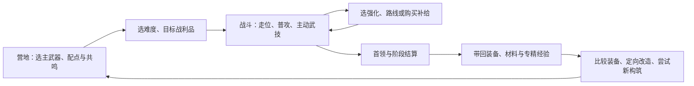

# 地下城动作刷宝改版：成长、资源与词条策划提案 V0.1

> 后续修订：Beta 开发请先读[开发指南 V0.2](dungeon-beta-development-guide.md)、[架构重构方案](dungeon-beta-architecture.md)与[合同草案](dungeon-beta-contracts.md)。产品负责人已修订方向：游戏厅平级入口、共用金币且金币参与成长、支持玩家装备交易、先做可玩短局。本稿中的独立经济、不开放交易等建议已撤销；其余细节作为玩法参考，不作为Beta全部必须实现的规格。

日期：2026-09-24。状态：**供团队定方向与原型验收的提案，尚非已批准的开发规格**。

本提案基于《长剑武器专精节点总表 V0.4（讨论稿）》、仓库现有地下城规划与战斗实现。用户已确认：**俯视2D自由移动；保留装备刷宝＋局内肉鸽**。其余规则为建议。附件里的“已确定”只代表该草稿的口径，不自动视为本次改版已经接受的要求。本文不修改附件，也不替换现有线上规则。全部新增数值均是可调的原型初值或验证目标，不是实测结论。

## 1. 建议先定下来的产品方向

**做“带着自己的武器流派进入地牢，在一局中随机长出不同打法，带回能启发下一套构筑的战利品”的单人动作刷宝游戏。**

快乐来源分三层：几秒内靠走位和攻击化解危险；几分钟内用随机强化改变打法；几局后用新装备和专精尝试另一条路线。耐玩来自不同构筑面对同一问题有不同解法，而不是让同一个百分比增长更慢。

### 1.1 本提案的工作假设

| 决策 | 建议方向 | 代价与尚待确认点 |
| --- | --- | --- |
| 视角（用户已确认） | 俯视2D自由移动 | 不设计跳跃与平台系统；用掩体、通道和包围形成空间变化 |
| 输入 | 八方向移动与闪避，默认自动普攻，保留攻击开关；方向瞄准、一个主动武技键 | 自动攻击不能锁死移动；武技提供主动爆发窗口 |
| 长期模式（用户已确认） | 保留装备刷宝＋局内肉鸽；建议专精和图鉴也永久保留 | 需要控制局外战力差，不然肉鸽和操作都会失去意义 |
| 单局 | 完整模式18～25分钟，可在房间间安全保存 | 原型先做8～10分钟，不先生产整套长流程 |
| 武器结构 | 一把主武器＋一个共鸣槽；共鸣只执行词条 | 不采用多把武器同时自动开火，保持动作可读性 |
| 角色 | 首版一个基础角色；角色外观不提供属性 | 暂不叠加职业树、角色树、宠物树 |
| 联机 | 首版单人 | 多人会改变暂停、索敌、掉落和构筑平衡，另立版本 |
| 经济 | 地下城独立成长资源，与庄园金币不兑换 | 放弃“统一金币买一切”，换取可控的成长速度 |
| 付费与交易 | 首版不做玩家装备交易、体力和付费战力 | 如以后需要商业化，必须先评估其对本循环的影响 |

参考边界：Brotato官方商店介绍包含俯视竞技场、默认自动攻击、短局与波次间购物，可借鉴其战斗与决策节奏。[Brotato官方商店](https://store.steampowered.com/app/1942280/Brotato/)。元气骑士官方应用介绍强调随机地牢与武器探索，可借鉴房间变化和发现感。[元气骑士官方应用页](https://play.google.com/store/apps/details?hl=zh_CN&id=com.ChillyRoom.DungeonShooter)。本文提出的永久装备、专精和经济结构是本项目设计，不把两款作品的具体规则混为一套。

### 1.2 三种方向的取舍

| 方向 | 最突出体验 | 主要风险 | 本次意见 |
| --- | --- | --- | --- |
| 每局装备清零，局外主要解锁 | 每次从零构筑，开局公平 | 很难容纳现有60点永久专精与长期刷装诉求 | 可作为未来独立挑战模式 |
| 永久装备＋局内随机强化 | 刷装目标清晰，每局仍有变化 | 局外完成全部构筑后，随机选择容易沦为补数值 | **推荐，须采用下文的系统分工** |
| 长时间副本＋大量装备等级与强化 | 数值积累反馈密集 | 容易变为刷材料交门票，动作与肉鸽退居其次 | 首版不采用 |

## 2. 核心循环与一局的节奏



### 2.1 完整模式结构

- 3个区域，每区3个普通/精英战斗房＋1个区域首领，共12个战斗房。商店与分岔作为房间间服务，不再塞大量无战斗走廊。
- 普通房目标60～90秒，首领75～105秒；加上路线和购物，目标18～25分钟。失败或主动撤离可以更短，统计时分开。
- 房间清理目标必须清楚：清场、定时生存、击破祭坛三类。首版同一房间只有一个主要目标。
- 每区第2个房间前提供一次二选一路线：稳妥补给，或可预览的精英威胁与定向奖励。路线奖励类别可见，具体装备词条不可预知。
- 生命跨房间保留，局内强化跨房间保留；敌人清空、战斗资源重置，详见第5节。进入新区域补充一个治疗次数，首区入场有一个，持有上限两个；每次治疗恢复最大生命25%，有0.8秒动作窗口，受伤打断不扣次数。
- 第一场结束就获得一次三选一；前三个战斗房内至少出现一项可感知的机制选择，不能把前五分钟做成纯属性铺垫。
- 完整局固定提供8次强化选择：房间1、2、3、5、6、8、9、11结束后。首领房4、8、12结算装备，其中房8先装备结算再选强化，顺序固定。
- 每区首领前有商店。购物和选择暂停战斗，玩家确认后再开始下一房；停留不消耗限时挑战的战斗计时，也不生利息。

### 2.2 玩家乐趣必须落到操作上

| 时间尺度 | 玩家在判断什么 | 需要的反馈 |
| --- | --- | --- |
| 0.2～2秒 | 绕开地面斩还是闪过弹道，是否抢武技窗口 | 清楚的攻击预警、碰撞、命中音与受击方向 |
| 3～15秒 | 先清远程怪还是攒剑势破甲，是否追击残血 | 剑势、剑式就绪与主动武技明确可见 |
| 1～3分钟 | 补生存、强化优势，还是承受代价改变打法 | 选择前后差异可读，立即能在下一房验证 |
| 1～3局 | 去哪里刷哪个机制、花资源修哪件装备 | 定向掉落、可预期的改造进展、装备比较 |
| 多次通关 | 换打法、挑战另一组规则、完成收藏 | 新解法与挑战，而非只增加敌人血量 |

### 2.3 失败、撤离与保存

建议采用“完成房间即保存已获得战利品”的低挫败模式，不做丢包撤离玩法。

| 终止情况 | 已完成房间的永久装备/材料/专精经验 | 当前未完成房间 | 局内钱、强化、剑势 |
| --- | --- | --- | --- |
| 通关 | 全保留，另得最终首领奖励 | 正常完成 | 全部清空 |
| 死亡 | 全保留 | 不发通关奖励 | 全部清空 |
| 主动撤离/放弃 | 全保留，无额外完成奖 | 不发奖励 | 全部清空 |
| 正常保存退出 | 留在该局，不能同时再开一局 | 战斗中只能暂停，不重抽房间 | 随快照保留 |
| 断线或服务重启 | 从权威检查点恢复，已发奖不重发 | 不把离线时间当继续战斗 | 恢复原状态和原随机序列 |

所有房间奖励按唯一房间完成凭据发放；结算界面只是汇总，不再次发一遍。武器专精升级虽可记入账号，但新增配点仅回营地生效。装备放入战利品袋，本局不能换装，下局才能使用。这样局内无需频繁打开背包比较，不会因换主武器让现有强化集体失效。

失败的损失是本次未完成的机会与后续奖励，不是销毁玩家已经拥有的装备。后续区域的收益/分钟应略高于首房重复刷，但不能仅靠通关大奖使失败局毫无收益。是否需要高风险夺宝模式，在基础循环成立后另行评估。

## 3. 成长系统：让四个系统各管一件事

| 层 | 负责回答的问题 | 可以提供 | 不应承担 |
| --- | --- | --- | --- |
| 武器专精 | 我擅长用什么方式战斗？ | 获势、保势、耗势与剑式路线 | 所有最强效果都永久包办 |
| 永久装备 | 我围绕什么特性去构筑？ | 基础属性、有限机制种子、某方向的效率 | 无上限装备等级压制；强制凑整套才可玩 |
| 共鸣 | 主武器事件能转换成什么帮助？ | 攻击事件转防守/范围/机动，定向跨武器联动 | 第二把武器的完整攻击和另一棵主树 |
| 局内强化 | 这一局我愿意怎样改变打法？ | 形态变化、环境适应、带代价的放大 | 只给永久装备补齐缺失的必要零件 |

“构筑可以运转”由局外保证，“这局怎么变强、如何取舍”由局内决定。进入第一房就有完整的基础攻防循环，不要求抽中某个稀有强化才开始好玩。

### 3.1 长期专精的推荐口径

暂保留附件的“1级1点、60级60点、各武器独立配点、只有当前主武器树生效、战斗外免费重配”。建议补定：**角色共享一个专精等级，每类已解锁武器各有相同点数预算；这些点不会因为切换武器叠加生效。** 这是新增提案，附件未明确经验究竟按角色还是武器分别累积。

理由：玩家获得有趣的新武器后，应能马上试，而不是再把相同的前期数值练一次。武器熟练挑战可以单独给外观、称号和预设，首版不再增加第二种战力经验。

推荐体验里程碑，须用新账号测试反推经验曲线：

| 阶段 | 体验目标 | 成长投放 |
| --- | --- | --- |
| 首次10分钟 | 认识一种剑式与一次局内变形 | 引导到Ⅱ层剑式，不给完整132节点图强迫阅读 |
| 约2～3次完整局 | 可购买首个Ⅲ层核心，体验共鸣 | 目标达到17点，失败也能靠已完成房间推进 |
| 约8～12小时 | 逐步拿齐60点，基础点数成长结束 | 中后段逐步开放复杂互斥选择，不无限加点 |
| 60点之后 | 新武器、装备方向、难度与自选挑战 | 不追加“巅峰无限属性”作为唯一终局 |

上述时间不应靠每日限制实现；如果节点过密，优先合并弱节点或调整经验节奏，不能用漫长练级掩盖选择缺乏差异。

### 3.2 永久战力的边界

- 不再额外加入随角色等级自动增长的攻防血；专精点就是等级的战斗收益。
- 装备只有3个有限强度档，首版不做无限装等与强化＋N。底材决定攻击动作，强度档决定基础属性区间，品质决定词条结构，三者分别显示。
- 同强度档、同专精预算下，成熟装备相对可获取的基础装备，木桩持续伤害和有效生存的提升各以约1.5倍以内为初测目标；属于可反驳的验证目标，机制收益也要计入。
- 不承诺新号能与满专精同强度；不同阶段有对应基础难度。到60点后不再用等级继续拉开差距。
- 难度固定，不根据玩家当前装备暗中缩放。高难度逐步增加敌人配合与规则，再小幅调数值。
- 当前已够用的低档机制装备，允许定向升到已解锁档位，保存其词条类型与档内相对卷值，避免所有心血随档位失效。

### 3.3 局内强化规则

采用6个槽，8次三选一。前6项不重复；满槽后只能替换或跳过，同名不叠级。一次选择界面提供：

1. 一个当前能生效的流派方向项。
2. 一个通用生存或机动项。
3. 一个可转向的冒险项；其必要前置必须已经具备，不能给死选项。

每张卡最多一个主要机制，写明收益、代价和触发限制。首版24张：6张通用、三剑式各4张、6张冒险项。每剑式4张中最多2张是改变主攻击形态的互斥候选；同一时间、同一形态组只留一个，替换前明确显示将失去什么。

开局选择一个偏好标签，仅提高相关选项出现权重，不能保证每次都是理想三件套。全局有2次免费重抽；跳过获得20局内钱。保底槽永远先过滤不兼容项，池耗尽时显示可用通用项或跳过，不生成无效卡。

换掉最大生命强化只改变上限：`新HP = min(旧HP, 新最大HP)`；加上限不治疗，重复替换不能回血。移除资源上限效果时截断溢出；取消由该效果产生的未结算预约触发；具体状态移除表随卡片配置交付。

## 4. 对长剑 V0.4 的逐项评审

### 4.1 值得保留的部分

- 三剑式围绕同一资源承担不同职责，具备形成不同动作节奏的基础。
- 免费重配、预设，以及只有主武器树生效，降低换流派成本。
- 单次主行动只选一种主剑式；派生伤害不递归启动自身，这些边界应该继续沿用。
- 共鸣只读取事件，不偷带基础攻击和第二棵专精树，方便控制复杂度。
- 前置、互斥和洗点回退已有清楚表达，可以成为完整树的数据规范。

### 4.2 当前最影响乐趣的风险

| 草稿内容 | 风险判断 | 建议处理与验证 |
| --- | --- | --- |
| 132节点中103个小/过渡节点 | 百分比和前置阅读量很高，实际打法变化未必相称 | 完整树先作为储备；原型用预设。完整树制作前合并缺乏体感的小节点，保留原ID映射 |
| Ⅲ层最短路径17点 | 它证明了路径长度，尚不能证明玩家17级时能理解或享受共鸣 | 先规定前两三局体验目标，再定经验曲线；不暗加章节门槛 |
| 每层多项1%～3%或0.2秒 | 玩家难以判断是否有价值；来源叠加后却可能异常放大 | 每项明确是成长填充还是玩法节点，后者必须出现可观察行为变化 |
| C04/C44/C48等自动索敌补偿 | 从自动战斗继承的需求可能不适合动作版 | 目标死亡后的合法重选、基础索敌稳定性应是基础体验；保留节点需重定义收益 |
| C28第二目标伤害衰减 | 尚未确定基础挥斩是否真的要对多目标衰减 | 先定俯视近战命中模型；无该基础规则则重做节点 |
| F09短暂延迟不丢锋芒 | 基础锋芒何时失效并未给出，节点效果无法核算 | 先补锋芒生命周期，再谈延长；首个原型建议房内保留，跨房清空 |
| D02自动补齐剑式序列 | 玩家可能只看见“自动触发了一堆东西”，无法主动影响结果 | 首版先验证单式；双式时显示下一式，主动武技能影响时机；记录等待时间 |
| Ⅴ层3种资源改写＋Ⅵ层7种极意 | 一个内容很容易牵动多种资源、事件和跨武器组合 | 保留为后续层，不把21种“破境×极意”组合一次性作为首版交付 |
| 先手门槛与动作倍率未全定 | 已有路径合法，不代表伤害与节奏能运行 | 补齐动作系数、前后摇、命中范围、取消窗口和首领对策后再调小节点 |

### 4.3 原型与完整树如何衔接

**不在本次文档里擅自把60点改成另一套点数，也不以“原型精简”宣称完整V0.4已实现。**

第一阶段做三个固定测试预设，仅包含各自完整的“基础挥斩→资源→剑式→Ⅲ层核心”行为；它们是测试工具，不是可购买的残缺天赋树。先比较近战连击、穿透剑气、重击破甲是否真的有不同解法。

通过手感验证后，第二阶段才做可编辑的Ⅰ～Ⅲ层；如沿用V0.4拓扑，应完整保留被使用节点的前置，不能把原本17点门槛随意删成更短路径。Ⅳ～Ⅵ层先以测试账号验证代表构筑，再决定保留、合并或移到局内强化。任何移位都要建立新版本，不把同一ID悄悄改为另一套语义。

共鸣解锁如采纳原稿，仍为**首次购买W08/Q08/F08之一即永久开放**；免费洗点与换武器不回收。同步发放一件与当前主武器有可触发事件的保底共鸣物，不再叠加另一个章节条件。原型中的强制开启只供测试，不算玩家解锁流程。

### 4.4 一把长剑的三种可测玩法

| 流派 | 玩家应感受到的节奏 | 擅长场景 | 需要解决的弱点 |
| --- | --- | --- | --- |
| 疾风 | 保持贴近，短连击后位移；满势溢出获得密集攻击窗口 | 持续接敌、清理近身敌群 | 弹幕与地形打断输出，不能靠吸血站桩 |
| 剑气 | 调整站位和方向，让多个敌人落在一条路径上 | 走廊与成列目标 | 贴脸包围或被掩体分割时需要换位 |
| 锋刃 | 攒势、等待首领空档、交一次重击再脱离 | 护甲精英和阶段弱点 | 蓄势期间有风险，失手后需要重建循环 |

三式都必须能单独完成首领；差别是完成方式与风险，不能靠“首领免疫某流派”制造伪多样性。

## 5. 资源系统：把战斗资源、局内钱和永久材料分开

### 5.1 资源清单

| 资源 | 来源 | 去向 | 何时重置 | 设计目的 |
| --- | --- | --- | --- | --- |
| 生命/治疗次数 | 初始配置、治疗、区域补充 | 承受伤害、治疗 | 新局 | 战斗与路线风险 |
| 剑势/锋芒 | 长剑动作与专精事件 | 剑式、武技 | 房间结束；局内临时暂停不重置 | 数秒内的输出节奏 |
| 局内钱「遗迹铜」 | 房间预算、事件、跳过强化 | 商店补给、临时强化、刷新 | 本局结束；不兑换永久钱 | 当局取舍 |
| 永久材料「锻材」 | 房间基础奖励、拆解 | 指定词条改造、档位提升 | 不重置 | 低随机性的积累出口 |
| 永久稀材「遗迹核」 | 区域首领保证、可选精英目标 | 机制装备定向制作、档位提升 | 不重置 | 中期明确目标 |
| 专精经验 | 首次完成本局中的战斗房，精英/首领有加成 | 自动增长专精等级 | 满60级停止战力成长 | 稳定解锁专精选择 |
| 图鉴/蓝图 | 首次击败、完成指定挑战 | 解锁制作与内容 | 永久解锁，不是可消耗货币 | 给玩家可追踪的新目标 |

首版玩家可花费的货币只有**1种局内钱＋2种永久材料**；不另增洗练石、强化石、突破石、祝福石和共鸣经验瓶。专精经验、图鉴属于进度，不能买卖。长期玩法需要新资源时，必须说明现有资源为什么无法表达该取舍。

### 5.2 剑势和共鸣的细则

- 普通剑势上限5；基础挥斩有效命中获得1层，每主行动最多一次，派生额外获势沿用草稿的每主行动最多1层。
- 同一目标被一剑多段命中不能重复贡献基础获势；打多个目标也不因人数翻倍充能。
- 基础剑势延续草稿“4秒未获势开始衰减，此后每2秒减1”。房间结束直接清空，防止把购物速度变成流派强弱。房间入场前3秒可暂停衰减，是否需要以实测为准。
- 空挥、攻击可破坏场景物、不受伤的训练道具不充剑势。训练场可提供独立调试开关，不能携带资源出场。
- 锋芒最多1，房内保留至消耗或角色死亡，跨房清空；这是动作原型建议，若采用，F09必须重设计。
- 主动武技与自动剑式使用不同就绪标识。原型建议武技采用独立8秒冷却、不消耗剑势，先验证主动操作价值；后续是否改为耗势须重评自动剑式争抢问题。
- 共鸣无额外常驻能量条，以指定事件＋内置冷却控制。主武器读不到所需事件的共鸣不能作为保底奖励，穿戴前提示具体不兼容原因。
- 破境资源改写、实际支出与返还分别结算。未来共鸣读取消耗量时不能把名义成本和返还后净成本混用。

### 5.3 局内经济初值

一个区域3个普通房，各给约40遗迹铜，首领给60；3区合计540。房内掉钱可采用自动吸附表现，但总量来自房间预算，召唤怪、无限增援不额外产钱。不放“永久幸运提高所有收益”词条。

商店每区一次，4个商品位，不卖永久装备或永久材料：治疗约40、下个房间有效的战术补给约35、一次局内强化候选约80（仍占6槽，不增加上限）。刷新费用依次10/20/40，同商店最多3次；只刷新未购买商品，已买不能重新刷出无限购买。价格供首轮测试，商店出现顺序不能决定是否必败。

买强化时先展示效果和被替换项，确认后同时扣钱与替换。补给不增加可读机制数量，例如“下房第一下伤害获得护盾”，同类不能叠加。商店不是必须买完的清单；存钱买强项与立刻补状态都应有合理场景。

### 5.4 永久经济的一次可核算样例

下表为基础难度、完整通关、没有额外精英路线的预算例，不是承诺的真实平均值。

| 项目 | 锻材 | 遗迹核 | 说明 |
| --- | --- | --- | --- |
| 9普通房×10 | 90 | 0 | 完成房间即保留 |
| 3首领×20 | 60 | 3 | 每首领保证1核 |
| 分解3件不保留的装备×10 | 30 | 0 | 假设共获4件、保留1件；非固定收益 |
| 样例合计 | 180 | 3 | 保留更多装备时锻材相应减少 |

消费建议：改变一条普通词条类型100锻材；选定普通词条提高一个卷值档60锻材；定向制作一件已解锁机制装备300锻材＋6核；升一档装备250锻材＋4核。

以180锻材/3核样例计算：两次完整局能够制作一件定向机制装备，但无法同时完成全部改造。这给玩家约40分钟级别的目标；如果实际玩家频繁失败，应以失败路径的产出重新核算，不能只拿通关样本定价格。

机制制作给固定底材与固定机制、普通词条仍按合法池生成；不会一次购买直接得到全满值毕业装。普通词条改造每件装备只允许选定一个改造位，选定后锁定位置；该位置可重复换类型或提升卷值。其它位置必须通过新掉落改善，保留刷宝价值。材料消耗固定、不涨价、不爆装备，随机“洗到满意”为后续可选方案，首版不采用。

从高强度档装备拆解得到的材料不与其制作成本倒挂；制作、升档和拆解全链路核算，不能产生正收益循环。低档刷材料的收益/分钟要低于相应可完成的后续档，不用惩罚性等级压制强迫玩家换图。

## 6. 装备与词条系统

### 6.1 装备结构与槽位

兼容现有六个永久装备部位：主武器、头部、胸甲、腰带、鞋、饰品；新增一个共鸣槽。先限制各槽职责，再增加内容。

| 部位 | 主要价值 | 首版限制 |
| --- | --- | --- |
| 主武器 | 基础攻击、动作底材、输出向普通词条，史诗可有1条机制 | 仅一把生效，局内不换主武器 |
| 头部/胸甲/腰带/鞋 | 生命、护甲、移动等生存与操作属性 | 原型固定属性；后续开放普通词条，首版无额外触发机制 |
| 饰品 | 一种资源/防守取向；史诗可有1条机制 | 不做套装计数 |
| 共鸣武器 | 只启用1条共鸣词条 | 基础攻击、普通词条、主手机制和该武器专精全部不生效 |

同一装备实例不能同时装入主手和共鸣槽。共鸣武器仍是武器物品，带有独立的共鸣字段；放主手时该字段不生效。共鸣解锁前，该类掉落池不开放；解锁后可出现带共鸣字段的武器。只有作为主武器也可玩的武器类别才进入主手武器池；原型中的共鸣载体可单独作为共鸣物品展示，不能假装其主手动作已实现。

同一时间永久装备最多提供“主手机制1＋饰品机制1＋共鸣1”。不让每个护具都长出一条自动施法链。装备底材的普攻形状属于基础动作，不另计触发机制。

### 6.2 品质、强度档与卷值

| 品质 | 普通词条 | 机制条 | 作用 |
| --- | --- | --- | --- |
| 普通 | 0 | 0 | 清楚的起始底材 |
| 优秀 | 1 | 0 | 初期方向选择 |
| 稀有 | 2 | 0 | 稳定、泛用的装备目标 |
| 史诗 | 2 | 武器/饰品可有1 | 提供有条件的构筑方向，不保证对所有流派更强 |

护具首版最高稀有；共鸣字段不因品质额外增加条数。强度档只设Ⅰ、Ⅱ、Ⅲ；Ⅰ档默认开放，首次完整通关基础难度解锁Ⅱ档，首次完整通关进阶难度解锁Ⅲ档，之后不再抬档。普通词条卷值用低/中/高三档，显示实际值和区间，不做难以看懂的多位小数。

同一装备不能生成同组冲突词条，例如两条“攻击速度”、同时减小和增大相同攻击范围。先过滤合法词条池，再按权重抽取不重复项；词条数量不足时配置校验失败，不静默少一条。首版不做鉴定费、不掉落背包里无法使用又无说明的职业锁装备。

### 6.3 普通词条首批候选表

下列范围是同档内低/中/高三档示例，百分比增幅与百分点明确分开。每件装备只抽其中允许的项目，不是每件都能出全部词条。

| ID/名称 | 低/中/高效果 | 部位 | 适用与限制 |
| --- | --- | --- | --- |
| A01 强攻 | 攻击力＋4/6/8% | 武器、饰品 | 与其它攻击力百分比加算 |
| A02 疾速 | 攻击速度＋4/6/8% | 武器、饰品 | 影响动作频率，不缩短闪避无敌间隔 |
| A03 精准 | 暴击率＋2/3/4个百分点 | 武器、头部 | 与暴击伤害区分 |
| A04 重创 | 暴击倍率＋8/12/16个百分点 | 武器、饰品 | 150%变158/162/166% |
| A05 宽刃 | 挥斩角度＋6/9/12% | 武器 | 不改变弹道伤害与攻击距离 |
| A06 远锋 | 剑气射程＋6/9/12% | 武器 | 仅剑气标签，不能抽到没有该能力的普通主手奖励上 |
| A07 贯甲 | 护甲穿透＋4/6/8个百分点 | 武器 | 受全局穿透上限限制 |
| A08 坚韧 | 最大生命＋4/6/8% | 胸甲、腰带、鞋 | 提高上限不即时回复 |
| A09 护甲 | 护甲＋4/6/8 | 头部、胸甲 | 加值而非减伤百分点 |
| A10 轻步 | 移动速度＋3/4/5% | 鞋 | 不缩短攻击前摇 |
| A11 调息 | 主动武技冷却恢复速度＋4/6/8% | 头部、饰品 | 冷却=基础冷却/(1＋恢复速度总和) |
| A12 稳势 | 剑势开始衰减的等待＋0.3/0.5/0.7秒 | 腰带、饰品 | 与每层衰减间隔分开；不能无限延长 |

定向奖励过滤依据是玩家选定的目标构筑标签，不因当前配点临时少一个节点而永远排除未来构筑。若标签方向尚未解锁，界面显示解锁条件；首个可用装备保底始终按当前能力过滤。

### 6.4 三条永久机制示例

| 名称 | 效果初稿 | 代价/弱点 | 不替代什么 |
| --- | --- | --- | --- |
| 回锋剑脊（武器） | 每次破锋命中后，下一次基础挥斩范围＋30%，只消费一次 | 破锋自身伤害系数降低10% | 不免费返还全部剑势，不包办锋刃循环 |
| 弧月剑格（武器） | 完整剑气首次碰墙反射一次，反射后保留50%该段伤害 | 原始最大射程降低20%；同目标本行动最多再命中一次 | 不获得Q12的双剑气与回流 |
| 行者结（饰品） | 闪避后首次基础挥斩命中，获得最大生命6%的护盾，持续2秒，冷却5秒 | 本装备不出现暴击伤害普通词条 | 不增加闪避无敌，也不提供无限吸血 |

永久机制适合提供“我想围绕这个试一局”的种子。史诗可以有代价，但不能隐藏代价；首版只做这类局部行为改变，不直接赠送整条极意。

### 6.5 六条共鸣示例与事件约束

以下是有方向的“长剑作为主手→共鸣效果”设计，不表示交换两把武器后效果自动成立。原型优先做前3条。

| ID/名称 | 读取事件 | 效果初稿 | 上限与用途 |
| --- | --- | --- | --- |
| R01 护势 | 实际消耗至少3层剑势 | 获得最大生命8%的护盾，持续2秒 | 冷却5秒，同源刷新不叠量；重击换防守 |
| R02 涟击 | 有效溢出获势 | 面前产生一次60%基础攻击系数的短冲击波 | 冷却3秒；每行动一次；连击换清群 |
| R03 定界 | 完整剑气主段有效命中 | 命中位置留下半径1.5角色身宽的减速区，2秒、减速20% | 冷却4秒，同时最多1区，首领只受5%减速 |
| R04 追步 | 主剑式完成结算 | 获得移动速度＋15%，持续1秒 | 冷却3秒，不叠层；输出换位移窗口 |
| R05 裂隙 | 成功施加破甲 | 向目标两侧各发出一个碎片，每个40%基础攻击系数 | 冷却4秒，原目标不再吃碎片；破甲换扩散 |
| R06 守成 | 基础挥斩命中 | 累计5个不同主行动，下一次有效基础命中给最大生命5%护盾 | 发盾后计数清零并冷却6秒；冷却期间不积数 |

R03要求新增规范事件 `sword.projectile_hit`，区分主段、反射和回流；它**不在V0.4已有五个接口中**，必须先增加事件规格，不能假称直接可用。其余读取现有事件也需补足字段，如实际支付量、有效溢出布尔值。所有共鸣生成的伤害和区域默认为派生来源，不再触发共鸣。

共鸣规则树首版后置。先让单条共鸣能明显改变体验，再引入独立点数的共用树；不能在一次改版里同时加入主武器完整树、共鸣树、装备机制和大量局内卡片，又无法判断是哪一层好玩。

### 6.6 九张局内强化示例

完整池目标24张，以下9张是需要优先实测的代表，不宣称其余内容已完成。

| 名称 | 收益 | 代价与行为变化 |
| --- | --- | --- |
| 风墙（疾风） | 疾风斩覆盖角度＋50% | 追加段射程－20%；更适合近身包围 |
| 追风步（疾风） | 每次进入无间，下一次闪避后普攻获得一次短追击位移 | 位移沿瞄准方向，可关闭自动释放；不穿越障碍，不增加无敌 |
| 藏势（疾风） | 溢出获势使下一次主动武技伤害＋30% | 武技冷却＋2秒；每个武技周期最多储存一次 |
| 扇流（剑气） | 一道完整剑气分为三道，系数各为原段45% | 同一目标同一行动仅承受其中最高一段；换清群、牺牲单体 |
| 凝束（剑气） | 剑气伤害＋40%、速度＋30% | 宽度－40%；与扇流互斥，要求准确站位 |
| 缓虹（剑气） | 完整剑气命中施加20%减速1秒 | 剑气伤害－10%；首领减速5%，不叠加R03数值 |
| 裂地（锋刃） | 破锋附带近地扇面冲击，系数为破锋原段50% | 破锋原目标不再吃冲击；蓄势＋0.15秒 |
| 断后（锋刃） | 破锋命中后下一次闪避距离＋40% | 下次基础挥斩获势前破锋不能再次就绪；奖励打一轮后脱离 |
| 孤注（通用冒险） | 生命低于40%时直接伤害＋30% | 最大生命－15%；血线条件明确，不叠加独立乘区 |

“附带伤害”都要说明原目标是否可再受伤、是否暴击、能否触发其它效果；不能只写“释放一道强力冲击波”。例如扇流即使打中同一大体积首领也不应意外变成135%单体加成。

## 7. 掉落、定向追求与毕业后的目标

### 7.1 掉落密度先少而有用

- 基础完整局保底4件：3个首领各1件，房间6额外1件；可选精英路线最多加2件。通常4～6件，不让玩家每局整理几十件垃圾。
- 共鸣开放后，每件装备先抽类别：普通装备80%、共鸣武器20%；开放前全为普通装备。首把适配共鸣由解锁奖励另发，不依赖这20%。
- 普通装备池按部位抽取：武器35%、饰品25%、其余四部位各10%。武器类别再按定向规则抽，不把“60%当前武器”误当作全装备掉率。
- 普通武器类别建议：玩家标记的已解锁目标类型60%，当前使用类型20%，其余已解锁类型20%；标记与当前相同则合并为80%。其余池为空时将权重归入标记类型。共鸣池独立按可触发事件过滤。
- 基础难度品质初值：普通10%、优秀45%、稀有40%、史诗5%；这个概率不包含首次/制作奖励。高难度提高稀有/史诗和高卷值比率，不独占某流派的基础运转机制。
- 首领在部位已确定后提供对应家族的定向机制候选；具体首领专属池在内容表列出。首杀给蓝图，累计两次基础完整局的保底核通常可制作目标机制，形成随机惊喜之外的确定性路径。
- 装备全部显示来源、可获得地图和制作条件；没有必要用“全地图极低概率”藏关键构筑。

这不是完整掉落配置：每个物品家族、品质适用部位、空池回退与权重必须在正式数据表里校验。例如护具不能出史诗时，其5%权重归入稀有，并在玩家看到的部位详情里显示真实概率。

### 7.2 刷宝的三个目标

1. **拿到能玩的机制**：首杀蓝图＋定向制作，约几局可追到，不因运气差永远不成型。
2. **找到更贴合的两条普通词条**：只能改其中一个位置，掉落有意义，但可救活接近合适的装备。
3. **优化卷值和收集替代方案**：有上限的毕业过程；毕业后转向另一构筑或挑战，不不断加装等重置原目标。

合适的稀有装应可能胜过不合适的史诗装。装备比较默认显示属性变化、机制变化和适配标签，不用单一战力箭头替玩家决定。

### 7.3 背包与负担

营地背包、独立战利品暂存、锁定、预设引用、拆解预览都应首版可用。预设引用视同保护，批量拆解默认排除锁定/穿戴/预设装备。容量满转待领取，不吞掉落、不强制在战斗中清包；待领取未处理完时可限制新开局并明确提示。

允许按“部位、主词条、共鸣事件、标签、是否高于已有卷值”筛选。自动拆解只在玩家设置后启用，首次获得的机制装备和未收录图鉴不自动拆。原型可以只做手动拆解，不能省略锁定与满包保障。

## 8. 战斗数值与连锁规则必须先统一

### 8.1 玩家可理解的基础属性

首版用生命、攻击、护甲、暴击率、暴击倍率、攻速、移速、攻击范围、护甲穿透、武技冷却恢复。剑势是武器资源。先统一伤害类型，不同时上法强、六元素抗性、命中、闪避、韧性、吸血与回复效率。

受伤主要靠动作躲避，首版不做随机闪避率。范围增加要明确影响角度、半径、投射距离哪一项。攻击速度不影响移速、持续时间、内置冷却；动作前后摇的可缩短部分由动作表明确，避免攻速让重击没有承诺成本。

### 8.2 原型伤害合同

```text
攻击力 A = (底材攻击力 + 固定加值总和) × (1 + 攻击力增幅总和)
有效护甲 D = max(0, 目标护甲 × (1 - 破甲比例) × (1 - 攻击者穿透比例))
单段伤害 = floor[A × 本段动作系数 × (1 + 适用的伤害增幅总和)
                    × 暴击倍率或1 × 100/(100 + D)]
```

剑势增伤、对精英增伤、该剑式增伤和临时条件增伤均进入“适用伤害增幅总和”，不各自再乘一次。动作系数调整是覆盖/段数与单体伤害取舍，例如扇流三段各45%；同名系数调整的优先级和互斥由配置声明。

原型移除现有±5%随机伤害波动，让测试更容易辨识词条收益；只有被允许暴击的直接段抽暴击。派生共鸣伤害默认不能暴击，读取主武器攻击力与其自身允许的增伤标签，不复制一次已经暴击后的最终伤害。

示例：攻击力100、破锋系数2.4、适用增伤共40%、本次暴击150%、目标护甲60、破甲30%、穿透20%，有效护甲为33.6，最终伤害 `floor(100×2.4×1.4×1.5×100/133.6)=377`。此例用于检查前后端一致，不代表实战平衡。

初测边界：暴击率最高75%，攻速最高基础的2倍，移速最高基础的1.5倍，穿透最高60%，单个破甲最高30%。超限值在面板显示已达上限，选择界面过滤完全无收益的属性。护甲本身用公式递减收益，不加第二套隐藏减伤。

其它减伤百分比加算后上限30%；不同减速取最强不加算；同源护盾取较高剩余值并刷新时长，全部护盾总量不超过最大生命30%。这些都是原型安全边界，必须在战斗说明与数值表一致。后续要突破上限，先有对应的新规则和测试。

### 8.3 事件结算顺序

以一个主行动为单位：

1. 读取资源、状态、就绪剑式和玩家输入，决定本次动作与朝向。
2. 选定唯一主剑式，检查门槛，支付实际成本；支付完成时生成资源消耗事件。记录行动ID与成本快照。
3. 动作运行到命中帧，进行碰撞和直接伤害。按动作规则逐段命中，同目标去重规则在动作表声明。
4. 对实际命中生成基础命中/剑气命中事件，进行允许的获势、破甲和返还；实际获势与有效溢出区分。
5. 主行动结束生成剑式完成事件。返还不回溯取消成本，不把返还重新算作该动作的基础获势。
6. 各事件在所属步骤进入稳定排序的效果队列；共鸣等派生效果处理时沿用同一行动ID和来源链，不能发回能递归触发自身的主武器事件。

消耗型护盾可以在第2步生效、保护蓄势；命中型护盾必须命中后才生效。不能为实现方便一律拖到动作末尾，改变词条实际用途。同一模拟步中队列按事件阶段、产生序号、效果ID稳定排序。

每个伤害事件至少包含：`run_id / action_id / hit_id / origin / parent_event_id / tags / target_id / actual_cost / proc_depth`。资源事件记录支付与返还为两个值。默认仅`origin=main_weapon`能触发共鸣；共鸣、反射追加、回流、地面持续段是否能触发普通装备效果必须逐条声明，首版统一不允许再触发其它装备派生。

每个效果明确“按主行动一次、按目标一次，还是按秒冷却”，并规定冷却从触发时还是效果结束时开始；本提案示例均从成功触发时开始。派生深度首版最多1层。性能超限时不能只偷偷删伤害；配置超预算应在测试阶段阻止进入发布池。

### 8.4 动作与空间规则

- 俯视八方向移动；自动锁定在攻击距离与可见范围内选敌，手动瞄准优先，锁定稳定性与目标死亡后重选是基础能力。
- 默认攻击不中断移动，但重击蓄势限制移速。原型建议闪避冷却2秒、无敌0.18秒；闪避可取消基础攻击后摇，能否取消重击前摇及取消后成本在动作表明示。
- 建议重击可以用闪避取消，已经支付的剑势不退、没有命中就没有命中收益；这是主动风险取舍。冷却武技在动作确认时进冷却，不能取消刷免费起手。
- 墙阻挡移动和普通投射物；只有声明穿墙或反射的效果例外。原型不做复杂高低差、弹跳物理与破坏地形。
- 接触敌人不自动持续掉血；敌人的伤害来自有预警的攻击/冲撞动作。身体阻挡要留逃生空间，角色不能被密集小怪永久卡死。
- 受击保护暂定0.35秒，同帧多个敌人攻击按照稳定顺序结算第一个有效伤害后进入保护；是否合并伤害不可由客户端帧率决定。
- 闪光和特效强度可调，危险预警始终在友方攻击之上；默认只强调暴击和大伤害数字。

## 9. 关卡和敌人要给不同构筑出不同题

### 9.1 最小敌人组合

| 敌人职责 | 攻击与预警 | 考察什么 | 公平性要求 |
| --- | --- | --- | --- |
| 追击者 | 接近后停顿再挥击 | 边走边打与近身清怪 | 挥击前至少有明确动作变化，不靠接触每帧扣血 |
| 弩手 | 瞄准线后发射直线弹 | 先手处理远程威胁、横向移动 | 未进入视野不发射无法预判的高速弹 |
| 重甲卫 | 正面防御、攻击后侧面暴露 | 破甲、绕后或抓攻击间隙 | 正面减伤有上限，所有流派都有解法 |
| 冲撞者 | 标出路径后冲锋，撞墙硬直 | 诱导站位与利用地形 | 预警后不无限追踪玩家改变路线 |
| 支援者 | 给附近敌人有限护盾 | 目标优先级与穿透 | 支援范围可见，不能无限互保成无解局 |
| 召唤者 | 引导后召少量单位 | 是否中断、群伤效率 | 召唤有数量上限，召唤物不产额外经济资源 |

首领原型用一名“遗迹守卫”：扇形挥斩、延迟地面标记、定向冲撞三招，加可攻击空档。第二阶段先改变招式组合，不直接同时加快所有预警与叠满弹幕。

敌人池扩展应增加职责，而不是只改颜色和血量。每个房间控制“同时处于进攻状态的敌人数”与危险区域覆盖，数量多不等于每只都同时攻击。

### 9.2 构筑验证矩阵

| 试验场景 | 疾风预期解法 | 剑气预期解法 | 锋刃预期解法 |
| --- | --- | --- | --- |
| 密集低血群 | 连斩压制、扩角覆盖 | 拉成一线穿透 | 保留蓄势窗口，用冲击清侧翼 |
| 分散远程怪 | 用移动窗口接近、逐个追击 | 绕掩体制造射线 | 抓单个目标破锋、再脱离 |
| 护甲精英 | 持续输出、绕后 | 保持距离与暴露期输出 | 破甲与重击优势明确 |
| 单体首领 | 学会进场和撤离节奏 | 预判位移、不能靠无脑回流多算命中 | 用空档承诺蓄势、失误有代价 |

如果某流派只能打某一行，属于功能不完整；如果某流派四行都无条件最好，属于优势没有代价。不能通过给敌人整类免疫来修补。

### 9.3 重玩内容的优先顺序

先做不同敌人搭配、不同掩体结构、奖励分岔，再做自选挑战规则。每区至少两种布局模板，地图随机只在经过测试的模板组合上发生；不要先做无限程序生成地图。

挑战规则应可预览，例如“远程敌人更多，但精英多给一件目标部位装备”“治疗较少，但首领额外给核”。规则不能抽到使当前装备完全失效的组合；每局最多叠加2条实质战斗规则，组合白名单与冲突表单独配置。

成熟后可加固定装备/专精预算的种子挑战，测操作和临场选择；先不上账号战力排行榜，不把尚未受控的客户端战斗结果用于公平竞争。

不把耐玩押在每日签到、每日必须打满、赛季强制清零和无尽血量膨胀上。终局允许玩家“这套毕业了”，再给一个想尝试的新目标。

## 10. 一次完整体验样例

以下是设计演示，方便团队判断循环是否连贯；不是随机结果保证。

玩家已解锁17点锋刃预设，带一把稀有长剑（攻速、穿透）、基础护具和“护势”共鸣，准备刷回锋剑脊的蓝图/材料。

1. **营地**：看到自己的优势是破甲重击，弱点是群怪。标记长剑为目标掉落，选择基础难度。没有合适史诗也能运转。
2. **房间1**：学会攒势、等精英抬手后闪到侧面破锋。第一张卡在群体冲击、生命提升和低血增伤之间选“裂地”，下一房立刻看到攻击覆盖改变。
3. **房间2～3**：因为裂地蓄势更久，玩家开始用护势护盾保护爆发；另选机动和生存通用卡。商店选择治疗，放弃一次额外强化候选。
4. **首领1**：拿到1核、20锻材和装备，永久保留。新装备进入战利品袋，先继续战斗，不要求停下来洗装。
5. **第二区域**：分岔显示重甲精英路线多一件目标部位装备。玩家判断这套破甲适合该挑战，选择加压；捡到攻速更好的稀有长剑，成为下局目标。
6. **房间8之后**：6槽已有明确配合。剩余两次选择需要替换：提高爆发会减少机动，因此根据最后区域敌人选择保留机动。这次随机没有抽到理想增伤，仍有可行方案。
7. **最终首领**：玩家依靠预警和攻击空档通关，或因贪蓄势死亡。无论哪种，都能带回已完成房间的材料和装备，并知道下次该改善哪一环。
8. **回营地**：比较新长剑；若两局已积够材料，则定向制作回锋剑脊。免费改专精或保留当前预设，再开一局尝试更高覆盖的打法。

下一局即使仍带同一把剑，也可能改走单体爆发、保守护盾或灵活追击，不能总是拿到相同的六张必选卡才成立。

## 11. “好玩、耐玩”如何验证

不把平均在线时长长当作好玩，也不把高留存预设成结果。先用愿意反馈的玩家观察真实决策，再用数据找问题。首轮邀请8～12人、覆盖动作游戏新手和熟练者；人数只够发现明显问题，不足以作统计显著性结论。

### 11.1 原型验收目标

| 问题 | 观测方式 | 初步通过信号/修正方向 |
| --- | --- | --- |
| 基础战斗本身是否好玩 | 使用固定装备、关掉成长奖励，连续玩5分钟 | 仍有可描述的躲避和进攻决策；若不成立，停止加成长系统 |
| 三式是否真的不同 | 同预算同场景切换3预设；每式至少体验两局 | 玩家能说出各式的一条优势和弱点，而不只说谁伤害高 |
| 第一次机制选择是否足够快 | 从首次进入战斗计时 | 目标3分钟内能看到并选到有体感的变化 |
| 词条是否看得懂 | 选择后让玩家复述“为何选、下一房想怎么用” | 多数人能说明效果；无法复述则先改文案/机制复杂度 |
| 随机选择是否有取舍 | 记录每张卡的出现、可选次数、选择率和替换原因 | 控制流派/阶段后，长期>70%优先检查是否必选，<10%检查是否死选；低样本不直接判废 |
| 玩家是否输得明白 | 死亡后展示最近受伤来源、位置与预警 | 玩家能说出主要失误；若经常是“看不见”“没法躲”，先修战斗 |
| 是否被迫重复刷弱关 | 比较每难度每分钟锻材/核/可用装备产出，分成功与失败 | 能完成后续难度的玩家有理由前进；不能只看总产出 |
| 是否愿意再开一局 | 自由体验结束后观察自发重开，访谈其具体目标 | 理由是想试一种组合/改善一次操作，而不只是清每日任务 |
| 失败是否仍有进展 | 追踪达到相似区域的失败玩家 | 能看见距制作/解锁目标的进展，不因连续失败被锁在入门阶段 |

### 11.2 必须记录的遥测

最少按配置版本记录：实际战斗时长、菜单时长、房间死亡来源、走位轨迹采样、伤害按来源占比、剑势浪费率、各剑式就绪与等待时间、共鸣触发次数、强化出现/选中/替换、资源收入支出、装备保留/拆解/穿戴、每局目标掉落命中情况。

特别看五类异常：

- 同一主行动的派生伤害占比过高，或某共鸣贡献超过主武器打法，可能是触发漏限或角色被副效果取代。
- D02某式持续就绪却长时间无法释放，说明选择器饿死该式，不应先加伤害补偿。
- 玩家高比例跳过全部选项，说明随机池兼容性/效用不足，不等于玩家不喜欢肉鸽。
- 某资源持续大量囤积而另一资源永远短缺，先调整来源与消费比例，不再发第三种补救货币。
- 某一打法在同预算、近似操作水平下对全部场景都占优，先减少无代价的多功能收益。

### 11.3 数值验证而非只测木桩

同样点数和装备预算，覆盖单体/5目标/分散远程/护甲首领四类场景；至少记录输出、承伤、攻击空窗、清场时间和失败原因。每个代表构筑用固定种子回归，再用不同种子检查极端情况。自动模拟能检查数值与连锁，不能证明躲避好玩，需要真人试玩。

完整树若仍采用V0.4，配置校验至少覆盖：三式17点最短路径、三套60点样例合法性、互斥、移除前置自动退款、共鸣解锁不回收、三种破境的支付与返还、首领/多目标/高速下的派生上限。本文仅阅读了节点总表，**未读取或验证其链接的JSON与交互预览**，不声称这些校验已经通过。

## 12. 开发范围与现有项目迁移

### 12.1 现有实现可以复用什么

已检查的本地代码包括 `estate/dungeon/combat.py`、`effects.py`、`runs.py` 和 `catalog.py`。当前战斗是玩家与单一敌人的时间轴，属性执行器只接受常驻加值/加算；新词条和实时移动不是填目录就能工作。原规划中按现实时间补算、离线自动继续和倍速，都需要在动作版重新定义。

| 能力 | 建议处理 |
| --- | --- |
| 账号、鉴权、请求幂等、奖励事务 | 复用现有基础能力，新增地下城资源账本，不用庄园金币当成长材料 |
| 装备实例、锁定、满包暂存、版本快照 | 保留设计；新词条、槽位、预设引用需新增数据版本与迁移 |
| 配置校验、确定性随机、事件来源 | 复用原则与可用工具，事件语义为动作版单独版本化 |
| 单敌人攻击时间轴 | 新建动作模拟层，负责位置、碰撞、输入、投射物与敌人AI |
| 离线补算与倍速 | 新模式不沿用；失去连接后由服务端暂停，恢复原快照，不自动替玩家战斗 |
| 扫荡 | 动作刷宝首版不开放，避免核心循环变成领取资源；若以后加，不能产核心稀有装备 |
| 旧奖励、旧进行中的战斗 | 旧版本按旧规则完成或显式终止补偿，新旧模式分开标识，不能一半旧一半新 |
| 既有金币和庄园库存 | 不清空、不自动折算；地下城资源独立存储 |

已有地下城装备是否需要纪念保留或一次性兑换，要先确认真实用户存档；当前提案不执行清库、强制迁移或上线替换。

### 12.2 动作技术原型必须先解决的产品问题

由于永久装备涉及服务端发奖，推荐正式版本保留服务端权威状态与奖励，客户端预测移动和播放表现。先用单房原型验证“输入延迟、校正观感、浏览器性能、服务端并发负担”是否可接受；不要以现有单敌人测试通过来推断实时动作架构已满足需求。

建议先测60fps渲染、30Hz权威模拟，50/100/200ms网络延迟，目标场景40敌人＋120投射物。它们是压力测试档位，不是已达成指标。前端纯本地原型可以用于验证手感，但必须标注测试环境、不得写正式奖励；不能把客户端提交的“我赢了”直接接入永久经济。

单人暂停允许；服务端在确认失联后冻结模拟，重连不重抽随机结果。多标签页只能一个控制端，其余只读；切后台需可靠暂停或显示已暂停状态，不能依赖浏览器仍稳定运行定时器。具体失联检测时间和输入缓冲需要在网络原型确定，不先写死为能保证零受伤。

### 12.3 分阶段制作，以验收门槛控制范围

| 阶段 | 必须交付 | 进入下一阶段前证明什么 | 暂缓内容 |
| --- | --- | --- | --- |
| P0 战斗验证 | 1角色、1长剑、3固定剑式预设、移动/瞄准/闪避/武技、4种敌人、1首领、训练场 | 固定装备也愿意连续玩；操作和危险清楚；无致命输入问题 | 永久经济、随机刷装、完整天赋UI |
| P1 单局闭环 | 8～10分钟：3普通房＋1首领，6张可体验强化、1商店、3共鸣、房间结算/失败保留/暂停恢复 | 随机选择会改变下一房打法，失败可解释，奖励不重发 | 三式融合、破境、极意、共鸣树 |
| P2 成长闭环 | 六装备槽＋共鸣槽、12普通词条、3永久机制、锁定/拆解/制作、Ⅰ～Ⅲ层可编辑专精、解锁保底 | 完成两三局后有下一局目标；不同构筑可成型；资源收支合理 | 新武器大批量制作、套装、交易 |
| P3 内容版 | 3区域/12战斗房、至少6种敌人职责、每区至少2布局、3首领、24强化、6共鸣、2档额外难度 | 完整流程18～25分钟，重复局有可描述差异 | 联机、无限成长、排行榜 |
| P4 扩展评审 | 按测试结果选择新增武器或双式融合，再评估Ⅴ～Ⅵ层 | 新系统带来新的决策，未压垮阅读与触发预算 | 不把132节点×多武器当首发硬指标 |

P1的强化次数与房间数是原型专用配置，不使用完整版8次选择表。P1可在房间1/2/3后各选一次，商店再给一次付费选择，验证时只要求尝试其代表机制。P2仍可复用短局；成长速度用测试配置加速，不能把测试经验直接上线。

未了解团队人数、素材产能和目标设备前，不给伪精确的工期承诺。先按上表定义可验收交付，再由程序、美术、策划估工并拆任务。

## 13. 开发前需要冻结的策划包

这份提案给出结构与代表规则，**不等同于全部生产配置已经完成**。下列产物应在对应阶段开工前落实负责人、版本和验收人。

| 文档/数据 | 必须写清的内容 | 开始依赖它的阶段 |
| --- | --- | --- |
| 一页产品决策表 | 视角、操作、单局、保留项、失败代价、是否交易 | P0，见下方决策表 |
| 动作表与敌人招式表 | 帧/时长、碰撞、预警、移动限制、取消窗口、资源支付、命中上限 | P0 |
| 房间与刷怪表 | 出生位置、进攻人数预算、目标、结束条件、可走区域、奖励上限 | P0/P1 |
| 战斗公式与事件表 | 加算/乘算、标签继承、触发上限、结算顺序、护盾/破甲/减速 | P0/P1 |
| 局内强化与商店表 | 全量ID、前置/互斥/权重、替换移除、价格、保底与空池回退 | P1 |
| 专精经验与节点表 | 1～60经验曲线、每房经验、完整前置、免费重配、预设、解锁流程 | P2 |
| 装备与掉落表 | 底材/强度档/品质/部位/词条池、权重、蓝图、定向与制作 | P2 |
| 经济测算表 | 成功/失败/撤离收益，制作、升档、拆解和目标时间 | P2 |
| 状态保存与旧档方案 | 断线、多端、暂停、满包、奖励唯一凭据、版本升级与回滚边界 | P1/P2 |
| UI流程与资源清单 | 准备/战斗/选择/商店/结算/装备比较，角色和敌人动作、特效、音频预算 | P0持续细化 |
| 试玩记录与指标字典 | 目标玩家、测试种子、行为指标、失败归因、修改前后对照 | 每个阶段 |

词条数据建议统一字段：`id、版本、展示文本、所属系统、适用部位、标签、前置、排斥组、触发事件、条件、效果、数值范围、冷却、每行动/每目标上限、叠加规则、移除规则、掉落权重`。先把代表内容填完整并执行，再扩展数量，不用只有名称和一句效果的表直接驱动开发。

### 13.1 下一次策划讨论的决策表

| 决策 | 当前状态/推荐答案 | 为什么要先定 |
| --- | --- | --- |
| 俯视还是侧视 | **用户已确认俯视2D自由移动** | 决定操作、地图与敌人设计 |
| 永久刷装还是每局清零 | **用户已确认永久装备＋局内肉鸽** | 决定死亡结算与成长主轴 |
| 操作和目标设备 | 推荐自动普攻＋方向瞄准＋闪避＋主动武技；先桌面键鼠验收，移动端触控单列 | 移动端需虚拟摇杆/自动瞄准方案，不应最后被动压缩UI |
| 新装备本局能否换 | 推荐本局只存战利品，下局使用 | 这是刷宝发现即时性与构筑稳定性的真实取舍 |
| 60点/132节点如何处理 | 暂保留60点方向与完整稿储备，先预设验证，再开发Ⅰ～Ⅲ层 | 防止把未证实的复杂度变成开工规模 |
| 专精经验归属 | 推荐角色共用等级，各武器独立配点 | 决定换武器是否需要重复练级 |
| 永久资源与庄园关系 | 推荐锻材/遗迹核独立，无金币兑换 | 避免外部财富绕过成长 |
| 失败保留范围 | 推荐已完成房间全保留，当前房无奖励 | 决定收益计算、挫败感和奖励事务 |
| 共鸣首发深度 | 推荐先1槽、单条效果，规则树后置 | 限制连锁和学习成本 |
| 永久改造规则 | 推荐一件只选一个改造位，可定向更换和提升 | 在低挫败与持续刷宝之间建立边界 |
| 第一版验收 | 推荐以P0/P1的可玩性与奖励可靠性为门槛 | 不能以“节点全做完”代替游戏好玩 |

### 13.2 对V0.4的变更登记摘要

| 类别 | 内容 |
| --- | --- |
| 建议保留 | 60点、当前主武器树生效、免费重配、三剑式资源分工、单主行动、共鸣来源隔离 |
| 新增待讨论 | 角色共用专精等级、局内强化职责、永久战利品下局使用、独立经济与定向改造 |
| 动作版需重做 | 自动索敌体验类节点、锋芒生命周期、基础挥斩多目标衰减、动作前后摇与取消 |
| 新增接口 | 剑气主段命中事件、方向与位置、动作/命中ID、主动输入与空间查询 |
| 分期实现 | 双式融合、破境、极意、完整共鸣树；先验证而非删除设计 |
| 本文未完成 | 全132节点配置校验、全部24张强化、完整经验曲线、全部装备底材、真实经济和真人试玩验证 |

## 14. 资料与适用范围

- 用户提供：[长剑武器专精节点总表V0.4](/Users/lhy/Downloads/长剑武器专精节点总表V0.4.md)。本地附件含132节点文本与路径说明；其中链接的配套JSON/HTML不在本次核验范围。
- 仓库：[地下城功能实施规划](estate-dungeon-design.md)、[前端美术与数值交接](dungeon-collaboration-handoff.md)、[庄园经济](estate-economy.md)。其中“未来规划”不等于当前功能，本文对关键技术现状另核对了代码。
- 外部参考仅用于识别产品特征：[Brotato官方商店](https://store.steampowered.com/app/1942280/Brotato/)、[元气骑士官方应用页](https://play.google.com/store/apps/details?hl=zh_CN&id=com.ChillyRoom.DungeonShooter)。本方案所有数值、节奏与资源投放为独立设计建议。

下一步最有价值的产出是一个能反复玩的短局：三种长剑打法、少量有取舍的强化、一次失败后仍看得见的刷宝进展。用它决定复杂系统是否值得继续投入。
