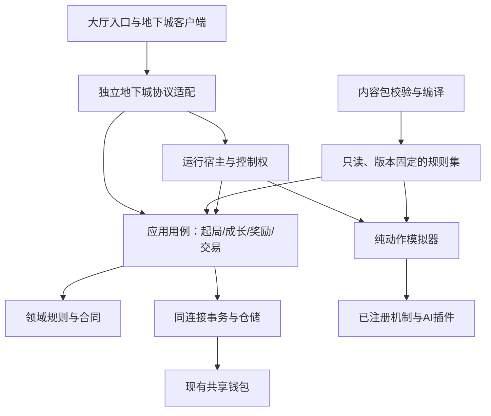

# dev 分支架构重构方案：地下城 Beta

日期：2026-09-24。2026-09-25 已实施首批公共底座，实际代码、测试和剩余任务见[交接记录](dungeon-beta-implementation-status.md)。本文保留完整目标方案，配套[Beta开发指南](dungeon-beta-development-guide.md)与[合同V1草案](dungeon-beta-contracts.md)；未在交接记录中确认的目录、接口、命令和表仍为拟建内容。

目标：在现有 Python＋SQLite＋WebSocket＋原生ES Module 部署内，建立与庄园平级的地下城模块。保留共享账号/金币，支持权威动作模拟、参数化成长与玩家资产交易。以小步迁移换取可并行开发，先不引入微服务、消息中间件、通用脚本语言或全站引擎重写。

## 1. 当前基线与具体缺口

检查基线：`dev/dungeon-core@97ca8f8`。UI参考是本地缓存 `origin/dev/dungeon-ui@fecd439`，公共祖先 `35ddde7`；未在本次任务中拉取远端或变更分支。

| 现有位置 | 已有能力 | 重构动作 |
| --- | --- | --- |
| `estate/dungeon/combat.py` | 单玩家/单敌人的确定性时间轴与快照 | 保留旧模拟器；动作版新增空间/输入/碰撞模拟器，不继续往旧循环塞分支 |
| `estate/dungeon/effects.py` | 仅passive、stat_flat、stat_add_bp | 抽出规则类型，增加纯机制注册接口；未知效果仍须拒绝 |
| `estate/dungeon/catalog.py` | Python内嵌目录、配置校验与公开裁剪 | 旧目录保留；Beta读schema校验后的内容包，再编译为只读规则集 |
| `estate/dungeon/actions.py`、`receipts.py` | 单账号幂等、装备操作和版本检查 | 提炼应用用例与仓储，补跨账号成交、物品预留及新回执版本 |
| `estate/dungeon/runs.py` | 服务器现实时间补算、暂停/倍速、一次性战斗发奖 | 旧语义留给旧局；Beta独立run表与运行宿主，分房奖励 |
| `estate/dungeon/schema.py` | 装备/穿戴/旧局/奖励/回执等表，部分ALTER兼容 | 引入有编号的迁移，保留既有数据和旧回执 |
| `server/estate/dungeon.py` | 鉴权、异步入口、线程执行SQLite、事务与推送 | 迁出庄园目录，拆旧协议适配与Beta协议适配 |
| `server/wallet.py` | `adjust_coins(conn, ...)`在调用方事务中改余额和记流水 | 经钱包端口复用，不能在插件里直调或另开事务 |
| `server/app.py`、`schema.py` | 显式模块装配、重复handler拒绝、数据库初始化 | 注册独立地下城模块、启动/关闭运行宿主、迁移入口 |
| `assets/js/game-config.js`、`hall.js` | 游戏厅入口；solo卡片文案写死“进入庄园” | 加地下城链接型入口和通用入口文案，不走庄园view |
| UI分支 `/dungeon`、`dgn-*`、views | 独立登录/连接、准备/装备/旧战斗/结算 | 复用导航与页面；用传输适配层接Beta合同，动作页替换旧事件播放器 |

三个必须在框架阶段处理的实际约束：

1. **共享钱包是REAL金额。** `users.coins`与流水为SQLite REAL，当前函数四舍五入到2位；仅新建一个整数交易表不会让全站余额自动变成精确整数钱。
2. **物品状态和穿戴槽有SQL CHECK。** 当前物品location只有bag/pending/sold，loadout只有六部位；不能只在Python增加escrow或resonance字符串就认为迁移完成。
3. **账号关联混用可变名称。** 旧表大量以username/owner文本关联；当前管理工具改名表清单未覆盖地下城表，且通用循环不处理owner列。Beta交易增加跨账号归属后必须补这一链路；不能依赖改名永远不发生。

当前连接工厂也没有全局启用外键，旧删除依靠触发器。新表不能只写`REFERENCES`就假设删除已可靠处理；需明确迁移、连接配置与管理服务行为。

## 2. 目标结构与依赖方向

推荐模块化单体：领域隔离，运行和存储仍由同一服务宿主管理。

```text
dungeon/
  contracts/       # 类型、事件、错误、纯插件接口；A维护
  domain/          # 物品/成本/进度/run状态和不变量；A维护
  application/     # 起局、成长、奖励、交易等用例；A维护
  storage/         # SQLite仓储、事务、迁移、回执；A维护
  runtime/         # 模拟宿主、输入邮箱、控制权、检查点；A维护
  simulation/      # 动作循环、碰撞、动作/AI系统；B维护
  plugins/         # 受信任的内置机制与纯规则策略；按能力归属
  content/         # 加载、校验、编译、规则集公开裁剪；A维护
  legacy/          # 旧模拟器/目录/旧局兼容，迁移完成后仍按需保留

content/dungeon/
  packs/<pack_id>/ # JSON内容、manifest、配置版本；C维护
  release.json    # 生效包与插件版本的固定组合；A发布
contracts/dungeon/
  schemas/        # JSON Schema、传输对象、内容包schema；A维护
  fixtures/       # 前端/模拟器/内容共同使用的正反例
server/dungeon/   # WebSocket协议适配、宿主装配；A维护
assets/js/dungeon/
  dgn-*.js        # 优先复用已有命名，逐步拆transport/api/store
  views/          # 准备、装备、成长、交易、结算
  combat/         # 输入、预测、渲染和表现
```

文件名按实现适度合并；不要第一天创建几十个只有接口的空类。以下边界比层数重要：



- 领域/模拟/机制插件不得import server、sqlite3或WebSocket，不得自行取系统时间和随机数。通过窄接口读状态，返回可验证操作。
- 应用用例持有事务与永久资产权威。前端、内容包和模拟器只能提出输入或事件，不能直接提交金币增量。
- runtime负责调度和存档，不编写每把武器的效果。传输层处理鉴权和序列化，不拥有伤害公式。
- 客户端运动预测只为交互；伤害、掉落与正式成长由服务端决定。不要维护两套互不核对的完整战斗规则。

### 2.1 第一轮文件迁移映射

| 当前路径 | 第一轮目标 | 兼容处理 |
| --- | --- | --- |
| `estate/dungeon/combat.py`、`catalog.py`、`effects.py`、`runs.py` | `dungeon/legacy/`下同名模块 | 先只调整内部import，不同时改旧结算语义 |
| `estate/dungeon/actions.py`、`service.py`、`receipts.py` | `dungeon/legacy/`下同名模块 | 后续由旧协议适配新的资产门禁；旧回执算法保留 |
| `estate/dungeon/schema.py` | `dungeon/storage/legacy_schema.py` | 新migration runner调用旧初始化，再执行有序Beta迁移 |
| `server/estate/dungeon.py` | `server/dungeon/legacy_protocol.py` | 旧消息名不变；另建beta_protocol，不挤进旧handler |
| `estate/dungeon/__init__.py`及旧模块路径 | 临时兼容导入薄层 | 指向新位置，无反向依赖；待所有调用方更新后再移除 |
| `server/app.py`、`server/schema.py` | 调用新装配/初始化入口 | 旧测试先验证行为一致，再启用新协议 |

Beta的新应用服务与动作模拟器从新目录开始写，不通过复制一整套旧业务再各自修改来维持双版本。R1只搬迁和建立兼容，R3再集中改写资产入口，方便追踪回归来源。

### 2.2 大厅与独立页面接入

大厅元数据建议增加`entry: {kind: "url", href: "/dungeon", label: "进入地下城 →"}`；保留庄园现有view方式。hall按entry.kind处理独立链接，按独立label显示文案，不再假设所有solo都进入庄园。地下城仍标记solo，从多人房间列表排除。

优先复用UI分支已有`dungeon.html`与`deploy/serve.py`的`/dungeon`路由，更新部署说明、前端模块可达性和大厅导航测试。只新增所需页面白名单；服务端内容包仍在`content/`下，通过get_catalog裁剪公开，不把完整掉落/规则JSON搬到公开assets目录。共享登录token与账号，不复制用户库或单独注册流程。

## 3. 参数化的层次

| 类型 | 放在哪里 | 示例 | 生效方式 |
| --- | --- | --- | --- |
| 部署参数 | 服务端配置 | 并发局上限、队列上限、存档频率、功能开关 | 重启或受控更新；不允许客户端覆盖 |
| 产品策略 | 经审核的规则包 | 是否局内换装、失败保留、费用、可交易标志 | 新命令/新局固定版本；敏感改动需共享经济验证 |
| 玩法内容 | C线JSON包 | 武器、敌人、房间、节点、词条、强化、商店、掉落 | 校验通过后形成规则集，按版本发布 |
| 机制代码 | B/A线可信插件 | 破甲、投射物反射、AI状态机、新资源转换 | 新插件版本＋测试＋内容依赖声明 |
| 不变量 | A线核心服务 | 不能负余额、重复成交、两个拥有者、无回执发奖 | 不作为可关闭的玩法参数 |

让“金币能否不足额也升级”“是否检查物品所有者”可配置不属于灵活性。可以调费用和解锁条件，不能关掉资产检查。

参数规范：ID使用带命名空间的稳定标识；时间用整数tick/ms并注明换算；比例用bp；金额用整数最小单位；位置用固定精度单位；拒绝NaN、Infinity、布尔冒充整数、未知字段和范围外值。配置默认值在schema/编译器集中定义，前端不自行猜另一套默认值。

不提供任意公式字符串或eval。成长费用可用分段表，常见公式用已注册策略ID＋有限参数表达；新策略写纯函数、给边界测试。

## 4. 标准化扩展机制

### 4.1 三种扩展，权限不同

| 扩展 | 能做什么 | 不能做什么 |
| --- | --- | --- |
| 内容包 | 声明已有操作、前置、标签、权重、成本与实例模板 | 运行Python/JS、注册SQL、替换鉴权、发钱 |
| 机制插件 | 消费战斗事件与只读上下文，返回有限的战斗操作 | 访问数据库/网络、直接改永久物品或金币、启动后台线程 |
| 核心策略提供器 | 计算升级报价、掉落计划、交易适用性等纯结果 | 自己应用扣费、转移资产或提交事务 |

注册接口统一由核心验证：唯一ID、API主版本、参数schema、状态schema、可读事件、可产操作、依赖、执行顺序、资源预算、卸载/状态迁移能力。显式事件订阅和稳定优先级替代任意猴子补丁。

Beta使用**仓库内白名单注册**，可审查的Python模块由A装配。若后续做独立分发，再以Python标准entry points（建议组名`relaxweb.dungeon.plugins`）发现已安装包，发现后仍校验白名单与版本。当前项目`package=false`，此时直接写entry points并不会产生可用的已安装插件体系。[Python entry points文档](https://docs.python.org/3/library/importlib.metadata.html#entry-points)

插件API和manifest是本项目版本化合同，不冒称某个外部游戏引擎标准。内容和消息结构采用[JSON Schema 2020-12](https://json-schema.org/draft/2020-12)；A线选择兼容当前Python最低版本的验证库并锁定依赖，不能只做前端校验。

这些Python插件是可信项目代码，接口约束不是恶意代码沙箱。Beta不开放玩家上传执行代码，不做线上热安装；不需要为尚不存在的第三方市场设计安全隔离平台。

### 4.2 加载流程与版本

```text
读取发布清单 → 解析依赖/检查版本 → schema校验 → 引用与语义校验
→ 机制/状态/资源预算校验 → 编译只读规则集 → 固定摘要 → 开新局可用
```

语义校验包括重复ID、缺失引用、天赋前置环、互斥不可达、空掉落池、负成本、无效交易标志、无对应机制的效果和递归触发。内容层不能覆盖另一个包的ID；确需替换用显式替换声明与兼容校验。

版本分开：`protocol_version`、`plugin_api_version`、`simulation_version`、`save_version`、`ruleset_id`。内容仅调数值不一定升级协议；改变存档结构必须升级save_version；改变结算语义必须升级模拟/机制版本。

每局冻结规则集、插件版本与初始装备属性；每次升级/交易记录使用的经济规则版本。更新时旧局继续使用原版本，旧报价使用创建时冻结的价格/税费；规则因缺陷紧急撤销时，显式作废尚未成交报价并解除预留，不悄悄换价。

发布配置可影响新局，但**Beta不做正在运行的插件代码热替换**。进程重启后旧局恢复需要相应模拟代码仍可加载；做不到时阻止该版本发版或采用明确维护结算方案，不能只保存旧JSON却加载新执行器。

### 4.3 实际扩展验收

必须展示两次扩展：C只改JSON加入一件现有能力组合装备，无需改核心；B增加一个纯减速/反射机制提供器和其测试，C引用后能用于新装备，无需改交易/奖励代码。如果每个新词条都要往全局if/else追加分支，注册架构尚未成立。

## 5. 共享金币、成本与事务

### 5.1 钱包适配，不复制钱包

新增`WalletPort`由应用层注入，其唯一正式实现包装现有共享钱包。客户端统一称“金币”，API金额用`coin_minor`，1金币=100最小单位；旧`coins`响应兼容字段由适配层换算，不同时展示成两种钱。

现有钱包仍使用REAL，Beta建议先做受限兼容桥：

1. 成本、报价、手续费与新交易记录全用整数最小单位，禁止输入浮点价格；UI将最多两位小数的字符串精确转换。
2. 在同一数据库连接、同一写事务中读取现有余额，使用明确的Decimal舍入规则转为最小单位。非有限值、异常小数和超出经测试金额范围拒绝操作并报告，不静默截断大额余额。
3. 校验足额后通过`adjust_coins`应用转换后的delta，记录统一业务ref；重新读取余额转回最小单位，必须与预期整数余额一致，否则回滚整笔操作。
4. 原子交易同时核对买方、卖方余额；所有beta用例均走该端口，不能直接`UPDATE users`。
5. 初始受支持范围建议余额/单笔不超过10^12最小单位（100亿金币），A用边界和随机往返测试确认后才冻结；超界明确报错，由维护者处理，不能因检查失败偷偷少收钱。

这是一段有边界和校验的兼容期，不宣称REAL已具备任意金额精确性。SQLite官方说明浮点是近似值。[SQLite浮点说明](https://www.sqlite.org/floatingpoint.html)。长期如迁整数钱包，必须由全站单独迁移所有读写路径、管理命令、牌局和转账，切换为单一权威字段；本轮不创建两套各自可写的金币余额。

### 5.2 应用事务模板

```text
鉴权和规范化请求（无副作用）
→ BEGIN IMMEDIATE
→ 先查持久回执：同ID同参数直接返回；同ID异参数拒绝
→ 读取当前用户/资产/版本/预留/规则，核对前置
→ 计算权威成本与结果；客户端预期成本仅作防误买前置
→ 检查所有资源，再一次性扣金币/材料并变更资产
→ 更新聚合版本，保存唯一业务记录与回执
→ COMMIT
→ 再推送最新状态或失效提示
```

SQLite同时只能有一个写事务；`BEGIN IMMEDIATE`会提前获取写事务，锁竞争仍需处理。[SQLite事务说明](https://www.sqlite.org/lang_transaction.html)。保持事务短小，模拟、网络发送、动画等待、长文件读取和任意插件执行不放在写锁内；纯策略预编译，小量权威计算可在事务里执行。

`adjust_coins`只记录流水，现有ref索引不是唯一业务回执，不能用它替代幂等。Beta使用自己的`(user_id, request_id)`回执、订单终态与唯一结算ID共同约束。

网络断开或推送失败不回滚已成交交易。Beta不要求先上消息队列：保存可查询回执、版本和交易记录；重连重新拉取权威状态，推送是加速展示。推送采用“状态版本已改变”提示再查询，或有序发送新快照，避免迟到的旧金币推送覆盖较新余额。

永久命令的确定性业务失败也可保存失败回执并提交零资产变更，让原请求重试含义不变；数据库busy/存储失败不保存为终态失败，可用相同请求号重试。回执命中在当前版本校验之前，才能在成交后版本已经变化时正确重放成功。

### 5.3 升级用例

`GrowthPolicy.quote(item_snapshot, progression, target, rules)`返回条件、成本向量与确定的升级结果计划；`UpgradeService`重新校验并应用。首版可只支持固定等级提升，不强求随机洗练。

成本向量可以含`wallet:coins`、零种或多种`material:*`。局内货币只能用于run内命令，不能被永久升级配方引用。材料不足、金币不足、装备已变更或被预留时整笔失败。升级后物品版本递增，客户端显示服务端结果；当前战斗引用的装备禁止改造。

先查询报价，再提交预期物品版本、规则版本、目标等级和预期成本。服务端重算后的任何成本/效果变化均返回`quote_changed`，前端展示新报价后用户重新确认，不能自动用更高价格续扣。

## 6. 装备交易与统一资产保护

### 6.1 资产预留

Beta新增`dungeon_asset_reservations`，以`(asset_type, asset_id)`唯一标识预留，记录用途、引用ID、持有人和到期策略。物品仍保留原owner/location，预留是独立约束，不把escrow硬写入旧location CHECK。

预留用途先支持`active_run`与`trade_offer`。新开局预留穿戴快照引用的装备；报价预留对应装备。`InventoryService`作为所有永久写入口的共同门禁：穿戴、升级、分解、NPC出售、转移、创建报价、开局都检查同一预留规则。`locked`只是玩家收藏保护，不能替代服务端预留。

已穿戴、锁定、待领取、新手绑定、测试装备不能报价；预设引用装备Beta建议先要求解除预设引用再报价，防止成交后悬空。装备本身可以交易与否由资产策略判断。此策略可以增加材料类型，但交易事务仍由核心负责。

未参与当前战斗快照的背包装备可按策略交易；只更新营地资产版本，不影响run快照。新购买的装备进背包/待领取，本局是否能换装由单独的run策略决定，不能自动改变当前模拟属性。

### 6.2 订单状态与原子成交

```text
创建 → OPEN → ACCEPTED
            → CANCELLED
            → EXPIRED
```

终态不可逆。取消后改价须新建订单。过期由读取/接受时的服务器时间检查与维护清理共同执行；即使定时任务未运行，到期订单也不能成交。解除预留以订单状态为依据，不能只因内存计时器触发就释放仍有效资产。

接受报价事务：

1. 加载回执；读取订单，检查OPEN、指定买家、非本人交易、未过期。
2. 检查卖家仍持有该装备、物品版本与报价快照一致、唯一预留正是本订单；检查双方账号有效。
3. 按冻结价格和税费计算买家总支出、卖家净收入；权威读取买家可用金币，不相信会话缓存。
4. 同连接扣买家金币、加卖家金币，写双方流水与手续费去向。
5. 转移同一个物品实例的owner，不复制出新物品；进入买家bag或pending。移除卖家所有穿戴/预设引用必须是可验证前置或显式清理规则，不能遗留引用。
6. 原子更新订单为ACCEPTED、删除该预留、递增物品与双方资产版本、写成交记录和买家回执，提交。

任何一步失败全部回滚。两个买入请求或接受/取消同时到达，由数据库事务、订单版本和条件更新保证单一终态；检查UPDATE影响行数，不能仅靠一个进程内锁。

金额样例（仅fixture）：价格100金币=10000最小单位，卖家侧手续费250bp=2.5金币；买家−10000、卖家＋9750、销毁250，三者守恒。手续费按整数计算，建议向下取整，创建报价时冻结；费率0～10000bp，价格为正且在配置上限内，卖家净额不可为负。手续费不是伪造的系统账号余额。

### 6.3 与其它金币业务并发

玩家可能同时转账、在牌局中消费、购买庄园物品。地下城成交读取数据库实时余额；不因UI刚显示“够钱”就保证成交。共享写锁提供串行写入，旧业务若遭锁失败，应原样回滚并可恢复，不能在应用层先发成功通知。

至少测试买家“购买装备与转账同时花最后一笔钱”、两个订单竞争同一余额，以及卖家收款与其它消费并发。无需首版重写全站经济，但影响到的共享边界要测试。

## 7. 权威动作运行与断线恢复

### 7.1 模拟器和宿主分工

B实现纯模拟接口 `create(initial, rules, rng)`、`step(state, ordered_inputs, ticks)`、`snapshot(state)`、`restore(snapshot, rules)`。A提供每局独立的运行容器、顺序输入、随机源、时间推进、持久化和推送。具体签名见合同文档。

初始测试档位：30Hz模拟、60fps前端渲染、10Hz状态推送、每1秒检查点，实际以测量调整。模拟内部以整数tick计时，不每帧把1000/30四舍五入累计造成时钟漂移；秒数转换为tick的规则统一声明。位置可用1格=1024子单位；客户端插值允许浮点，权威碰撞只认服务端结果。

一个run只有一个权威运行容器和一个当前控制端。`input_seq`负责去重/顺序，`control_epoch`区分旧连接和新控制端；服务端限制输入速率、长度与可接受时间窗口。客户端不能提交任意推进秒数、未来伤害、命中对象或随机种子。

默认预测移动、显示攻击反馈，权威快照纠正；持久金币/装备从来不乐观展示为“已到账”。新控制端接管需明确用户动作，递增控制代次并拒绝旧输入，另一标签页只读。Beta先单服务实例部署，不宣称已实现跨进程房间分片；数据库唯一活动局约束仍必须存在。

起局先在事务中建立可恢复的READY记录与装备预留，提交后挂入运行宿主；提交后但宿主启动前崩溃，重启可从READY恢复为PAUSED，不能留下无法取消的活动锁。新旧模式共存期，旧/新起局都在同一写事务检查旧active_jobs和Beta活动局，并拒绝已有任何一种活动挑战的账号；Beta另设按user_id的活动状态唯一索引。旧active_jobs的kind CHECK不能未经迁移直接塞入beta_run。

### 7.2 避免模拟占用数据库和事件循环

- 每帧不写SQLite，不为每个命中创建永久数据库行；使用内存事件队列与定期检查点。
- 应用命令和运行容器使用分开的有界执行队列；SQLite连接在哪个线程创建，就在哪个线程完成并关闭。
- CPU模拟先采用有界专用执行器/工作线程并按run串行，实测GIL与并发影响；不足时替换为进程执行器，接口不变。不能把`asyncio.to_thread`误当作已经解决CPU吞吐问题。
- 输入积压、慢客户端与待持久化数量都有上限。展示增量可以丢弃后补全快照，资产事务、房间结果与确认消息不能因队列满丢弃。
- 错误先暂停该run并保留最后检查点；数据库落盘持续失败时停止推进，不能继续显示赢了却无法保存的奖励。
- `Application.run/aclose`接入地下城宿主生命周期；正常停服冻结输入、保存、暂停活动局，再关闭资源，避免退出触发额外奖励。

### 7.3 检查点与发奖原子边界

检查点包含：run/房间/tick、玩家/敌人/投射物状态、资源和局内钱包、效果实例与冷却、RNG状态、最后已应用输入序号、控制代次、规则/模拟/存档版本、下一次结算位置。

周期检查点约1秒，因此异常进程崩溃可能回到最近一次已保存状态，损失最多一个正常落盘周期附近的未确认战斗进度；存储拥塞时先暂停，不承诺永远精确1秒。客户端区分`server_tick`与`durable_tick`。这不会撤回已经确认的金币、装备或已完成房间；重连向用户说明恢复到存档点。

房间完成时：运行容器停止进入下一房，生成内部`RoomOutcome`；A验证它来自当前权威容器及预期房间版本，按规则生成奖励，在**同一事务**中保存房间完成检查点、唯一奖励凭据、物品/金币/进度及回执。提交成功后才能向客户端确认完成和推进下一房。不存在“先宣布奖励、稍后另存物品”的中间状态。

奖励唯一键建议`(run_id, room_index, reward_kind)`；每个普通房/首领的奖励计划明确类别，重放只返回原结果，不重新抽奖。最终通关奖与房间奖用不同kind，杜绝最终结算页再发一次各房奖励。

临时断线后不补算离线杀怪，服务器在失联策略触发后暂停；连接失联检测窗口内仍可能继续模拟，UI与测试必须承认此边界。重启后Beta活动局一律以PAUSED恢复，客户端重新申请控制权；旧版本自动战斗仍按旧规则，不混用。

## 8. 数据结构与迁移

### 8.1 复用与新增表

| 数据 | 建议方式 | 核心约束 |
| --- | --- | --- |
| 用户/共享金币/流水 | 继续users、coin_transactions | 唯一共享钱包；新业务ref可追溯 |
| 已有装备/背包 | 复用dungeon_items并增加Beta所需版本化payload/绑定来源字段 | 不改旧实例ID；快照保存真实获得时属性；旧字段保留兼容 |
| 穿戴 | 复用或有序重建dungeon_loadout约束以支持resonance槽 | 同一实例不能重复穿戴；物品slot仍是weapon而非resonance |
| 档案 | 增加mode/迁移标志与新的成长payload、资产版本 | 旧客户端不得越过Beta资产门禁 |
| Beta局 | 新建dungeon_beta_runs | 一个活动局、固定规则集与完整检查点，旧局表不重解释 |
| Beta房间结算 | 新建dungeon_beta_rewards | run/room/kind唯一，与资产同事务 |
| Beta写回执 | 新建dungeon_beta_receipts | user_id/request_id唯一；参数摘要、结果、状态码、格式版本 |
| 物品预留 | 新建dungeon_asset_reservations | asset_type/asset_id唯一，reservation_ref可追踪 |
| 报价与成交 | 新建dungeon_trade_offers、dungeon_trade_settlements | 一个订单最多一次结算；不可变双方/价格/规则快照 |
| 永久辅助材料 | 确需时新建dungeon_material_balances | user_id/material_id唯一、数量非负、同事务改动 |
| 内容/迁移记录 | 新建dungeon_rulesets、dungeon_migrations | 规则集摘要唯一；迁移序号与校验和受控 |

Beta表以稳定`users.id`作为账号外键语义。旧物品owner仍为名称时由仓储在事务内解析ID与当前规范名称；后续通过一次性迁移补owner_id并切成单一权威关联，不长期让两种owner字段各自可写。账号改名期间需停止该账号活动局或拒绝改名并给出可操作原因，防止运行容器保留过期身份。

管理命令需要新增明确映射，而非只扫描列名：旧地下城username列和items.owner都要迁；交易以user_id关联不受改名影响。删除账号先撤销其未成交报价并解除预留，处理活动局，再删除账号和私有数据；已成交对手方拥有的装备不能被卖家注销连带删除。审计记录采用保留稳定ID/脱敏展示策略，不能依赖未启用的ON DELETE CASCADE自然正确。

### 8.2 旧入口的保护

两种兼容方式择其一逐步落地：旧装备动作适配到新的InventoryService；对已经迁到Beta的账号，旧写协议明确返回`mode_migrated`，前端刷新进入Beta。不能让旧`dungeon_sell_item`在报价中仍直接修改dungeon_items。

旧活动局允许在其原模拟器完成后迁入Beta，或由明确的维护操作结算；不要在迁移时隐式重新抽掉落。原型物品默认不可交易，旧正式物品是否进入Beta掉落强度需迁移映射，不自动全部变成高价值货币来源。

### 8.3 迁移流程

1. 在备份副本上记录各表行数、余额、装备归属、旧局和回执抽样，检查孤立记录。
2. 显式有序迁移，保存编号/校验和；重复执行应无新变化。需要重建CHECK约束的表使用新表复制、核验、事务切换，不能靠CREATE IF NOT EXISTS修改旧约束。
3. 同时更新删除触发器/管理工具和schema读取版本；旧版本未必能读新库，回滚优先关闭新功能/运行兼容旧逻辑，不盲目回退二进制。
4. 验证改名、删除、满包、活动局、绑定物品、已售物品、新手发放都不会丢失或复制。
5. 先兼容代码、后开放开关；保留旧查询和结算能力。新版本若需停止接单，拒绝新报价/新局，但仍允许查询、撤销、到期释放与已提交结果恢复。

不要在三个开发分支各自分配相同迁移编号；A统一分配与合并，B/C只有迁移需求没有自行覆盖schema的权限。

## 9. 可实施的重构PR顺序

| PR | 工作范围 | 完成后可以解锁什么 | 必须验收 |
| --- | --- | --- | --- |
| R0 基线和分工 | 记录当前测试结果，盘点UI分支，补本指南/合同fixture | B/C开始针对同一接口工作 | 不冒称未运行测试通过；未提交成员文件不被覆盖 |
| R1 命名空间解耦 | 建顶层dungeon、server/dungeon；迁旧代码到legacy/适当模块，旧import临时转发 | 地下城不依赖庄园入口，旧功能仍运行 | 不改旧公式/数据/回执摘要；旧测试通过、无循环import |
| R2 合同与内容加载 | 模型、错误码、schema、registry、规则集版本、一个最小包、fixture适配器 | C可独立填配置；B可实现模拟器/页面 | 正反例校验、引用/版本/重复ID拒绝；固定包能加载 |
| R3 资产与金币用例 | 同连接UoW、仓储、WalletPort、幂等、预留、升级、旧入口门禁 | B接真升级；交易与起局共用保护 | 金币/材料不足、重复升级、旧接口绕过与故障回滚 |
| R4 运行时和权威奖励 | 有界宿主、控制权、输入、检查点、房间结算、生命周期 | B的模拟器进入正式闭环 | 断线/重启、双标签控制、重复房间完成、无客户端造奖 |
| R5 玩家交易 | 定向报价、预留、接受/撤销/过期、余额/所有权原子交割 | 两账号真实交易 | 并发、满包、金额守恒、共享经济竞争与故障注入 |
| R6 合流与开放 | 真实短局、成长/交易UI、内容经济、迁移演练、运行指标 | 对玩家开放Beta | 开发指南整体验收；已知限制与配置版本完整 |

R4和R5在R2/R3边界稳定后可并行；B无需等R5写完才做战斗。每个PR都有可用纵向路径，不要求先把整个目标目录创建完。

第一批由我们完成的框架重点是R1～R3：让成员“知道往哪里写、怎么运行、怎么验证”，随后按实际瓶颈推进R4/R5。后台执行与交易属于同一A线的不同任务，分工人数增加时可拆给独立成员，但核心合同仍由一处维护。

## 10. 验证与开发工具

### 10.1 现有命令与拟建命令分开

现有基础回归入口（本次仅文档工作，未运行这些业务测试）：

```sh
uv run --locked python tests/test_dungeon_foundation.py
uv run --locked python tests/test_dungeon_combat.py
uv run --locked python tests/test_dungeon_equipment.py
uv run --locked python tests/test_dungeon_runs.py
uv run --locked python tests/test_dungeon_protocol.py
uv run --locked python scripts/run_python_tests.py
npm run test:browser
```

其中全量测试用于集成阶段；单功能开发先跑受影响集合。浏览器测试脚本要求8000端口可用，避免抢占他人的预览。UI分支自带的测试在其合入后再作为主分支入口，不提前宣称当前分支已有。

A需要补的工具：内容包validate、固定种子headless短局、生成/校验公开合同fixture、测试库两账号与余额初始化、规则集差异报告。建议统一CLI如`python -m dungeon.tools validate-content ...`，但在实际提交前只是拟定名称，不能作为现有可执行说明分发。

### 10.2 必须补的测试矩阵

| 类别 | 关键案例 |
| --- | --- |
| 纯规则 | 同种子同输入同结果；派生不递归；动作取消成本；节点/效果移除后清理 |
| 插件/内容 | 重复ID、版本不兼容、依赖环、未知操作、空池、非法金额、不可序列化状态 |
| 成长 | 同请求重放；旧报价变化需重新确认；金币/材料一项不足均无扣除；活动/报价装备不可改 |
| 交易 | 同订单两个接受、接受与取消、过期但尚未清理、错买家、自买、卖家改名、满包、测试物品禁售 |
| 故障注入 | 扣买家后、加卖家后、转装备后、写回执前故障全部回滚；提交后响应丢失返回同一成交 |
| 共享钱包 | 买装备与转账同时花最后余额；金额最小单位往返；手续费守恒；不使用缓存余额 |
| 运行恢复 | 双标签旧epoch输入被拒；乱序/重复输入；保存中崩溃；确认过的房间不再发奖 |
| 数据迁移 | 空库/旧库/重复迁移；旧回执重放；旧写入口不绕预留；删除卖家不删买家已买装备 |
| UI端到端 | 大厅→短局→结算→升级→两账号交易→满包领取→重连确认余额 |

### 10.3 可观测性与可维护性

每条关键日志包含`user_id、request_id、run_id/offer_id、ruleset_id、protocol/simulation/save版本、事务/结算ID、错误码、耗时`；不写密码、认证token或全量玩家输入到普通日志。

最先观测：模拟step耗时P95/P99、活动局数、输入队列深度、检查点落后tick、写事务等待/耗时、SQLite忙错误、重复请求回执率、交易成功/失败分类、金币净产出/净消耗、待领取积压。发布记录把指标与规则版本关联，才能区分性能问题和数值问题。

性能验收由目标设备/服务器实测定义。建议先测1/5/10个并行局及典型/峰值怪物数量，对比聊天和其它小游戏响应；失败则限制并发或降低模拟负荷，不靠增加无界线程隐藏瓶颈。

## 11. 本轮明确不做的架构工作

暂不做全站微服务化、全站钱包迁移、开放式插件市场、玩家脚本沙箱、通用ECS编辑器、分布式撮合、每个伤害事件全量落库、任意公式DSL和所有系统热更新。它们不应成为做出第一版的前置条件。

保留可替换接口即可：WalletPort可在未来切整数钱包；Simulator可切执行器；AssetPolicy可增加材料；规则包可以新增武器；传输适配可换更高频通道。每个抽象都要由本次至少一个实际用例验证，而不是为了远期假设制造空层。
