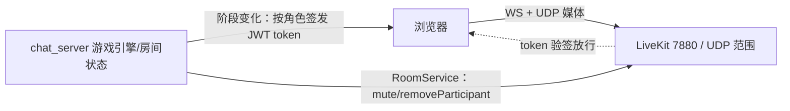

# 狼人杀语音聊天：调研与实现方案

调研日期：2026-09-24；同日修订：评估"比 WHIP/WHEP 更轻量或更合适"的路线后，新增方案 E（LiveKit）与方案 F（WebSocket + 服务端混音），首选决策改为 E。语音尚未接入线上，狼人杀玩法引擎另立文档。所有代码引用以当日工作区为准。

## 1. 建议决策

1. **首选方案 E：自托管 LiveKit**（Apache-2.0，Go 单二进制 + systemd，与现有部署风格一致）。它是专做实时通话的开源 SFU：官方 Python 服务端 SDK（`livekit-api`）负责按游戏角色签发短时 JWT 与服务端强制禁言，官方 JS SDK（UMD 包，可 `<script>` 引入、无需构建）负责发布/订阅/重连/说话指示。此前方案 B 里需要手搓的信令 ACL、WHIP 发布器、订阅 diff、重连逻辑全部由现成件替代。
2. **决策规则**：能接受多一个常驻服务 → E；坚持零新增进程 → 在 F（复用现有 WS，最轻基础设施，弱网上限低）与 B（复用 MediaMTX，WebRTC 传输质量，授权与禁言靠手搓且无服务端禁言）之间取舍。原 B 方案设计保留在 §5 附注。
3. **前置硬条件不变：先上 HTTPS。** 生产实测只有 `http://<公网IP>:8000`（80/443 未开放），浏览器在非安全上下文禁用 `getUserMedia`，所有方案共同的前提。域名 + nginx TLS 是第一张工单。
4. 频道逻辑（白天/夜晚狼队/死者）由 werewolf 房间引擎计算并下发给传输层；传输层只执行授权。隐私红线：修改过的客户端也不能偷听狼人频道，裁决必须在服务端（E 的 token 签发 / B 的 auth 裁决 / F 的进程内成员表）。
5. 方案 A（P2P mesh，需 coturn）与方案 D（商业 TRTC/声网）维持降级位；方案 C（aiortc 自研）仅在需要服务端录音/ASR 且 F 的传输质量不达标时升级。

## 2. 已核实的现状（代码事实）

| 事实 | 出处 | 对语音的意义 |
| --- | --- | --- |
| 单进程 asyncio + `websockets`，`ConnectionHub` 持有全部连接，带锁发送 | `server/transport.py` | 文字信令与 F 方案的音频流直接挂现有 8765 WS |
| 房间协议为 handler 注册表；新游戏 = `games/` 下 `BaseRoom` 子类 + `@register_room_type`，前端 `registerGame` | `server/rooms/protocol.py`、`games/base.py`、`assets/js/registry.js` | 狼人杀是标准接入 |
| 每用户私有视图 `view_for(username)`、观战视图 `spectator_view()`，服务端按权限投影 | `games/base.py:276` | 频道分配的权威出口：视图里下发 `voice` 字段 |
| 游戏房间状态**只在内存**，仅金币结算落库 | `server/rooms/host.py` | B 方案需跨进程 ACL 表；E/F 无此问题（授权在游戏进程内完成） |
| 直播已有生产级 WebRTC：MediaMTX WHIP/WHEP + `authExternalUrl` 鉴权；前端已有 WHEP 客户端 | `auth_server.py`、`assets/reader.js` | B 方案的全部基础；E 可借 nginx 同一套 TLS 反代 |
| 生产端口实测：8000/8765/8889 开放，**80/443 关闭** | curl 实测 2026-09-24 | 无 HTTPS → 麦克风被禁，共同前提缺口 |
| 现有牌桌 `max_seats = 9` | `games/base.py:73` | 狼人杀 6–12 人 + 上帝，werewolf 房间类单独放宽 |
| 前端零构建（原生 ES Module），依赖以自托管文件引入 | `assets/` | E 的 UMD SDK、F 的 WASM 编解码器都下载进 `assets/vendor/`，不走 CDN |

## 3. 狼人杀对语音的需求（推导自玩法）

| 阶段 | 频道 | 谁能说 | 谁能听 |
| --- | --- | --- | --- |
| 白天讨论 / 轮流发言 | 公开 | 存活玩家（轮次发言时仅当前发言人） | 全员 + 观战者 |
| 警长竞选 / 遗言 | 公开 | 竞选者 / 出局者 | 全员 + 观战者 |
| 夜晚狼队协商 | 狼队 | 狼人 | 仅狼人（服务端强制） |
| 出局后 | 静音或死者频道（规则可配） | — | — |
| 上帝（法官） | 全频道 | 控制发言权、**强制禁言**、递麦 | 全部 |

通用要求：静音与说话指示、发言计时、断线重连自动恢复、移动端 Safari/Chrome 可用、无麦克风用户降级为纯文字。其中"轮次发言时强制其他人闭麦、上帝能强制禁言"要求**服务端能单方面关掉某人的上行**——这是 E 相对 B 的关键优势（MediaMTX 无此 API，B 只能靠客户端自觉）。

## 4. 候选方案

### 4.1 方案 A：P2P mesh + 信令走现有 WS

两两 `RTCPeerConnection`，服务端中继信令并做角色 ACL。零新增进程、直连时零服务器带宽，但国内家宽互通必须自建 coturn，CGNAT 回落后带宽优势消失；观战者多时吃玩家上行。保留为熟人小局的备选。

### 4.2 方案 B：MediaMTX 星型（WHIP 发布 / WHEP 订阅）

每用户发布 1–2 路音频、按 ACL 订阅他人路径，`authExternalUrl` 裁决。复用现有设施、NAT 免疫、观战扩展好；但狼人频道授权要新增 `voice_acl` 表 + auth 进程解析路径（游戏状态在内存，需跨进程通道），服务端无法强制禁言，前端要手写发布器、订阅状态机与重连。**细化设计保留在 §5 附注**，作为"不引入新服务时的既定路线"。

### 4.3 方案 C：aiortc 自研 SFU/混音

进程内精确控频道、可录音/ASR，但重依赖 + 最大开发量。仅当录音成为硬需求且 F 传输质量不达标时考虑。注意 F 方案能以远低得多的复杂度拿到"混音 + 可录音"的收益，C 的立足点因此变窄。

### 4.4 方案 D：商业云（TRTC / 声网 / 即构）

SDK 与弱网质量最好、最快上线；持续计费、数据出域，违背自托管定位。体验兜底。

### 4.5 方案 E：自托管 LiveKit（升级首选）

[LiveKit](https://github.com/livekit/livekit) 是专做实时音视频的开源 SFU（Apache-2.0，Go 单二进制）。架构：



- **频道 = LiveKit 房间**：每个游戏房间拆 `ww-{room_id}-day` 与 `ww-{room_id}-wolf` 两个 LiveKit 房间。游戏进程在阶段变化时按角色签发短时 token（`AccessToken.with_grants(room_join, room=...)`）：狼人领双房间 token，非狼永远拿不到 wolf token；LiveKit 验签放行，改版客户端伪造不了。观战者只领 day token。
- **服务端强制禁言**：`LiveKitAPI.room.mute_published_track(...)`——上帝禁言、轮次发言控制、死亡即禁言都是服务端单方面生效，不依赖客户端自觉。
- **前端一个 SDK**：自托管 `livekit-client.umd.min.js`（约 355 kB，`<script>` 引入全局 `LivekitClient`）到 `assets/vendor/`。`room.connect(url, token)` 一次完成发布/订阅；自动重连、DTX、`activeSpeakersChanged`（说话指示）、音量事件全部内置，删掉方案 B 里最大的前端工作量。
- **Python 依赖**：`livekit-api`（PyPI，Apache-2.0），纯 HTTP 调用 RoomService + token 签名，无重传递依赖。
- **部署足迹**：一个 systemd 服务；TCP 7880（信令，挂 nginx TLS 后）、TCP 7881（TLS 回落信令）、UDP 端口段（默认 50000–60000，可在 `livekit.yaml` 收窄到如 50000–50100，阿里云安全组放行该段）。媒体为客户端主动外连服务器 UDP，与现有 WHEP 同构，**无需 STUN/TURN**。
- **注意**：LiveKit 内嵌 TURN-over-TLS 需要企业 license key（可免费申请但有流程）；本项目场景基本用不到 TURN，直接不启用，将来确有需求再外挂 coturn。
- 代价：多一个常驻服务与配置面；切频道 = 重连房间（约 1 秒，入夜/天亮各一次，可接受）；房间模型是"每人拉每路"，浏览器连接数与 B 相同（11 路），改善的是授权、禁言、重连与开发量，不是连接数。

### 4.6 方案 F：复用现有 WS + Python 服务端混音（真正零新增进程）

放弃 WebRTC 传输层，音频走现有 8765 WebSocket：

```
getUserMedia(AEC/NS 约束) → AudioWorklet 采集
  → WASM Opus 编码（20ms 帧，~24kbps） → WS binary →
服务端：opuslib/PyAV 解码 → 按频道混音总线 → 重编码 → WS 广播 →
客户端：WASM 解码 → Web Audio 播放
```

- 优点：**零新增进程、零新端口、零 WebRTC**；每客户端恒定 1 上 1 下（与人数无关）；频道 = 进程内混音总线成员表，授权最简单也最强；录音/ASR 近乎免费（在总线上挂个 tap 写文件）——服务端录音这个方案 C 的独有价值被顺手拿到。
- 代价：放弃 WebRTC 的传输质量——TCP 队头阻塞、无实时拥塞控制，抖动缓冲/丢包补偿要自己写，端到端延迟约 200–400ms，弱网下卡顿上限明显；新增 WASM Opus 编解码资产（~200KB）与 Python opus 绑定（`opuslib`/`PyAV`，Debian 有 `libopus0` 系统包）；12 路实时混音的 CPU 在单核几个百分点内，可忽略。
- 适用判断：狼人杀以半双工轮流发言为主、用户多为家庭宽带时，这个短板可以接受；且它是唯一同时满足"零新增基础设施 + 服务端录音"的路线。**HTTPS 前提与其他方案相同**（getUserMedia），WS 也要一并迁到 TLS。

### 4.7 对比总表

| 维度 | B：MediaMTX | E：LiveKit ★ | F：WS+混音 | C：aiortc | D：商业云 |
| --- | --- | --- | --- | --- | --- |
| 新增常驻进程 | 无 | 1（Go 二进制） | 无 | 无（重依赖入库） | 无（外部 SaaS） |
| 新增依赖 | 无 | `livekit-api` + UMD SDK | opus 绑定 + WASM 编解码 | aiortc/PyAV | 商业 SDK |
| 服务端强制禁言 | 无 | 有（RoomService） | 有（不发混音总线） | 有 | 有 |
| 频道授权位置 | auth 进程 + ACL 表 | 游戏进程签 token，验签强制 | 进程内成员表 | 进程内 | SDK 角色 |
| 前端开发量 | 高（发布器+订阅状态机） | 低（SDK 覆盖） | 高（采集/抖动/播放全自写） | 高 | 低 |
| 每端连接数 | N−1 | N−1 | 2（恒定） | 2 或 N | 1–2 |
| 服务器出口带宽 | 听众×发言×32k | 同左 | 听众×混音总线×24k | 同 F | 计费 |
| NAT 穿透 | 免疫 | 免疫 | 免疫（走 TCP/WS） | 免疫 | 免疫 |
| 服务端录音/ASR | 无 | 无（换 C 前没有） | 有（总线 tap） | 有 | 云端收费 |
| 弱网 QoS | WebRTC | WebRTC | TCP，上限最低 | WebRTC | 最好 |
| 主要风险 | 手搓面大、无禁言 | 多一服务；切频道重连 1s | 弱网体验 | CPU/维护 | 成本出域 |

## 5. 方案 E 设计细化

### 5.1 游戏引擎挂点（与 E/F 解耦）

werewolf 房间照常 `@register_room_type("werewolf")`；新增职责只有一个：在阶段迁移点（入夜、天亮、死亡、遗言、离桌、解散）计算每个用户的语音授权并产出"语音视图"：

```json
{"voice": {"rooms": ["ww-42-day"], "can_publish": true, "forced_mute": false, "speak_until": 1695555555}}
```

语音适配层（`server/voice_livekit.py`）消费该视图：diff 出应签发的 token（多房间）、需要 `mute_published_track` 的强制变更，经现有 `ConnectionHub` 下发新 token、调用 LiveKit API 执行禁言。引擎不感知 LiveKit；换传输层时引擎不动。**狼人杀引擎先在纯文字模式下完整可玩，语音是叠加层。**

### 5.2 Token 与生命周期

- token 有效期 ≤ 当前阶段预期时长 + 宽限（如 5 分钟），过期未换发自然掉线；阶段切换由引擎主动换发，不等过期。
- token 绑定 identity=用户名；同一 LiveKit 部署服务多个游戏房间，房间名前缀 `ww-{room_id}-` 隔离。
- 玩家离桌/房间解散：引擎停止换发 + `remove_participant` 立即踢出；LiveKit 房间无人后自动回收，无状态残留。
- API key/secret 放 `config.json`（不入库），与 `stream.publish_password` 同一管理方式。

### 5.3 前端 `assets/js/room-voice.js`

- 加载 `assets/vendor/livekit-client.umd.min.js`（自托管，不走 CDN）。
- 收到 `voice_update`（新 token 列表）→ 对每个目标房间 `Room.connect()`；旧房间 `disconnect()`。狼人夜晚同时挂 day（静音收听）与 wolf。
- 采集约束 `echoCancellation/noiseSuppression/autoGainControl: true`；**默认不开麦**，点击"上麦"触发 `getUserMedia`（用户手势，兼容 iOS 自动播放策略）。
- 说话指示用 `activeSpeakersChanged`；发言倒计时由 `voice.speak_until` 渲染；麦克风被服务端强制静音时 SDK 的 `LocalTrackPublication.muted` 事件反映 UI 状态。
- 无麦克风/拒绝授权：不连接任何房间，文字聊天照旧，其余玩家无感知。

### 5.4 带宽与容量测算（Opus 单声道 ≈32kbps，F 方案混音 24kbps）

| 场景 | 服务器出口（E/B） | 服务器出口（F） | 单用户上行（E/B） |
| --- | --- | --- | --- |
| 12 人局、轮流发言（≤2 人同时说） | 2 × 11 × 32k ≈ **0.7 Mbps** | 2 × 11 × 24k ≈ 0.5 Mbps | 32–64k + 订阅 0.35M ≈ 0.4 Mbps |
| 12 人局、自由讨论全员开麦（最坏） | ≈ 3.9 Mbps | ≈ 2.9 Mbps | ≈ 0.4 Mbps |
| 观战者 ×50 | 50 × 2 × 32k ≈ 3.2 Mbps | 50 × 24k ≈ 1.2 Mbps（混音优势） | 观战 ≈ 64 kbps |

LiveKit 与 MediaMTX 同为 SFU，出口带宽同级；混音（F）在大量观战时占优。需核对阿里云带宽计费模式，固定带宽建议 ≥5 Mbps。首版纯音频；将来露脸复用同一房间体系加 video track。

### 5.5 安全要点

- wolf 频道机密 = 拿不到该房间的有效 token；API secret 只在服务端，JWT 短时效；负向验收：改版客户端持 day token 订阅 wolf 房间必须被 LiveKit 拒绝。
- 上帝 = 引擎签发对两个房间 `room_join + can_publish` 的 token，且永不进 wolf 名单（旁观走引擎视图而非订阅，或按规则可听）。
- token 与登录会话解耦风险：签发前必须校验请求者即该 room 成员（信令里带 room_id + 服务端会话核对，同现有 handler 模式）。

### 附：方案 B 细化（若不引入新服务，沿用 2026-09-24 首版设计）

路径 `ww/{room}/{username}`（公开）与 `ww/{room}/wolf/{username}`（狼队）；新增 `voice_acl` 表（room_id, username, channel, can_publish, can_hear）由游戏进程在频道变化时 upsert，`auth_server.decide()` 对 WHIP/WHEP 请求解析路径后查表裁决（publish 用登录 token + can_publish；read 用 can_hear）；前端自写 `WHIPPublisher`（约百行，与 `reader.js` 对称）+ 订阅 diff 管理 + AnalyserNode 说话指示。其余（HTTPS 前提、带宽、降级、负向测试）与 E 相同。已知短板：无服务端禁言，轮次发言只能靠客户端自觉 + 房间规则约束。

## 6. 实施顺序与验收

| 阶段 | 交付 | 完成判据 |
| --- | --- | --- |
| V0 | 域名 + nginx TLS（反代 8000/8765/7880），全站 HTTPS | 手机浏览器地址栏锁形；现有直播/游戏回归正常 |
| V0.5 | 决策点：部署 LiveKit 试运行（systemd + 收窄 UDP 段 + 安全组）或确认走 F/B | 二进制跑通、token 能签发、安全组实测 UDP 连通 |
| V1 | 探针 `scripts/probe_voice.mjs`：Playwright 双浏览器上下文（`--use-fake-device-for-media-capture` 假麦），A 发布 → B 订阅；E 走 SDK，F/B 走各自链路 | 假麦链路往返成功；无权频道被拒（E：无 token 连接失败；B：403）；断线自动重连 |
| V2 | `room-voice.js` 通用房间语音（单一公开频道、自由麦），任意牌桌可开关 | 8 人房间实测：说话指示正确、断线 30s 重连恢复、CPU/带宽记录在案；无麦用户无感知 |
| V3 | 狼人杀引擎（文字可玩）+ 频道化语音（双房间 token、上帝强制禁言） | 负向测试：day token 连 wolf 房间被拒；服务端 mute 单方面生效；入夜/天亮换发订阅 <1s；死亡即禁言 |

必要故障测试：LiveKit 进程重启后的客户端自动重连、token 过期中途的续签、上帝禁言与本地静音的状态一致性、房间解散的 `remove_participant` 清理、iOS Safari 与 Android Chrome 真机（微信内置浏览器风险最高——WKWebView 的 `getUserMedia` 支持差，产品上引导"用系统浏览器打开"）。

下一步默认切片：**V0（HTTPS）→ V0.5（LiveKit 试部署，成本半天）→ V1（探针）**。V0.5 的半天试运行足以验证 E 的全部运维假设，再决定是否锁定 E，避免在 F/B 上投入后返工。

## 7. V0.5 部署记录（2026-09-24，裸 IP HTTPS 已就绪后执行）

前置：全站 HTTPS 已落地（`docs/https-ip-rollout.md`），`https://<公网IP>` 统一入口，
麦克风的安全上下文前提满足。

### 7.1 落地内容

| 组件 | 结果 |
| --- | --- |
| livekit-server 1.13.7 | `/usr/local/bin/livekit-server`，systemd `livekit.service` enabled；配置 `/etc/livekit/livekit.yaml`（模板 `deploy/livekit/livekit.yaml.example`） |
| nginx 信令反代 | `/etc/nginx/sites-available/relaxweb` 启用 `location /lk/` → `127.0.0.1:7880`（读/写超时 3600s），443 同端口对外 |
| chat 服务语音层 | `config.json` 增 `voice` 段（`wss://<公网IP>/lk`），live-chat 重启后日志 `voice enabled -> wss://…/lk (ttl 600s)` |
| livekit-api | 生产为系统 Python，`pip3 install --user livekit-api`（阿里云镜像），装进 `~/.local` 服务即可见 |
| 安全组 | UDP 50000-50100 已实测放行（ICE 直连成功即证明）；TCP 7880 未对公网开放，只走反代 |

### 7.2 踩坑与实测结论

1. **`rtc.node_ip` 必须用标量写法**（`node_ip: <公网IP>`）。1.13.7 的 `ips: {binds, resolves}`
   结构体虽能通过严格解析，但**不作用于 ICE 候选**（候选仍宣告私网 IP，客户端黑屏/连不上）。
   标量写法实测候选全部变为指定公网 IP。另：`use_external_ip` 依赖境外 STUN，CN 服务器不可靠。
2. **UDP 端口按会话分配**：每个参会者从 `port_range`（50000-50100）拿独立端口，安全组必须
   整段放行；空闲时 `ss -ulnp` 看不到监听属正常（懒分配）。
3. CN 服务器直连 GitHub release 不通：本地解析 302 签名直链（`objects.githubusercontent.com`
   可达）后服务器 `curl -L` 下载，或本机下载后 scp（本机 `~/.ssh/office` 密钥已加入服务器
   admin 的 authorized_keys）。
4. nginx 对 `/lk/` 的 `proxy_read/send_timeout` 给到 3600s，信令长连接不被默认 60s 掐断。

### 7.3 验证

- 本地回归：`tests/test_voice.py` 20 passed、`tests/test_werewolf.py` 16 passed、
  四浏览器 `tests/test_werewolf_voice.cjs` PASS（夜狼独占频道 / 天亮互听 / 假麦音轨往返）。
- 生产冒烟：`scripts/probe_voice.mjs`（双假麦直连 `wss://<公网IP>/lk`，
  不创建游戏房间、不碰 users.db）→ PASS 信令、PASS 订阅、
  ICE UDP 直连 `<公网IP>:500xx`（无中继）、音频字节流动。
  密钥经 `LK_KEY`/`LK_SECRET` 环境变量注入，不落仓库。
- 待办：真机多端（iOS Safari / Android Chrome）真麦首局联调；按 runbook §10 在 HTTPS
  稳定数日后关闭公网 8000。
